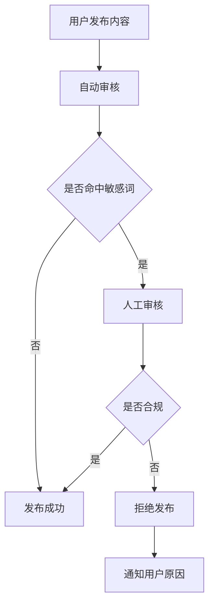

# 合规定位与文案规范

版本：v5.0（去医疗化合规版）  
更新日期：2026年6月17日  
文档类型：合规与规范

---

## 目录

1. [合规定位](#1-合规定位)
2. [禁止功能列表](#2-禁止功能列表)
3. [文案规范](#3-文案规范)
4. [内容审核规则](#4-内容审核规则)
5. [用户隐私合规](#5-用户隐私合规)
6. [广告合规](#6-广告合规)
7. [数据安全合规](#7-数据安全合规)

---

## 1. 合规定位

### 1.1 平台定位
本平台是一个**生活美学与自我提升**的社交平台，专注于为用户提供变美知识分享、生活方式建议和社交互动服务。平台不涉及任何医疗服务，不提供医疗诊断或治疗建议。

### 1.2 合规原则

| 原则 | 说明 |
|------|------|
| 去医疗化 | 所有功能和文案不得涉及医疗诊断、治疗、药品推荐等医疗行为 |
| 非专业建议 | 平台内容仅供参考，不能替代专业医疗建议 |
| 真实可信 | 不得虚假宣传或夸大效果 |
| 用户知情 | 用户需明确知晓平台内容的参考性质 |
| 内容审核 | 所有用户生成内容需经过审核 |

### 1.3 医疗红线

| 禁止领域 | 说明 |
|---------|------|
| 医疗诊断 | 禁止提供任何形式的医疗诊断服务 |
| 治疗建议 | 禁止提供疾病治疗方案或建议 |
| 药品推荐 | 禁止推荐或销售药品 |
| 医美项目 | 禁止推荐或宣传医疗美容项目 |
| 疗效承诺 | 禁止承诺任何治疗效果或疗效 |

---

## 2. 禁止功能列表

### 2.1 绝对禁止功能

| 功能类型 | 具体内容 | 风险等级 |
|---------|---------|---------|
| 医疗诊断 | 皮肤疾病诊断、健康状况评估 | 高 |
| 医疗推荐 | 药品推荐、治疗方案推荐 | 高 |
| 医美推广 | 整形项目推荐、医美机构推广 | 高 |
| 疗效承诺 | "根治"、"治愈"、"100%有效"等 | 高 |
| 虚假宣传 | 夸大产品效果、伪造用户评价 | 中 |
| 价格欺诈 | 虚假折扣、隐藏消费 | 中 |
| 数据泄露 | 未授权获取或分享用户数据 | 高 |
| 侵权内容 | 未经授权使用他人版权内容 | 中 |

### 2.2 需谨慎功能

| 功能类型 | 注意事项 | 合规要求 |
|---------|---------|---------|
| 皮肤分析 | 仅提供肤质类型分析，不涉及疾病诊断 | 需明确声明仅供参考 |
| 护肤品推荐 | 基于肤质推荐，不涉及治疗功效 | 需标注"非医疗建议" |
| 健康建议 | 仅提供生活方式建议 | 需明确"不替代专业医疗意见" |
| AI问答 | AI回答需经过合规过滤 | 禁止医疗相关回答 |

---

## 3. 文案规范

### 3.1 通用文案规范

| 规范类型 | 具体要求 |
|---------|---------|
| 避免医疗术语 | 不得使用"诊断"、"治疗"、"治愈"、"疗效"等医疗术语 |
| 避免承诺用语 | 不得使用"保证"、"一定"、"100%"等承诺性词汇 |
| 使用温和表述 | 使用"建议"、"参考"、"可能"、"有助于"等温和表述 |
| 强调非医疗 | 在适当位置添加"非医疗建议"声明 |
| 真实准确 | 文案内容需真实准确，不得夸大 |

### 3.2 各模块文案规范

#### 3.2.1 变美分析模块

| 场景 | 禁止文案 | 推荐文案 |
|------|---------|---------|
| 皮肤分析结果 | "你的皮肤患有XX病" | "根据分析，你的皮肤类型属于干性肌肤" |
| 问题描述 | "你的皮肤有严重问题" | "你的皮肤可能存在一些需要注意的地方" |
| 改善建议 | "使用XX药可以治愈" | "建议尝试保湿类护肤品" |

#### 3.2.2 姿造美学模块

| 场景 | 禁止文案 | 推荐文案 |
|------|---------|---------|
| 妆容推荐 | "这款妆容可以治疗痘痘" | "这款妆容适合遮盖面部瑕疵" |
| 穿搭建议 | "穿这个可以改善体型" | "这个穿搭可以优化身材比例" |
| 效果描述 | "完美妆容，立刻变美" | "精致妆容，提升气质" |

#### 3.2.3 AI变美顾问模块

| 场景 | 禁止文案 | 推荐文案 |
|------|---------|---------|
| 问题回答 | "你得了XX皮肤病" | "根据你的描述，建议咨询专业医生" |
| 产品推荐 | "XX药效果最好" | "XX产品可能适合你的需求" |
| 健康建议 | "这样做可以根治" | "这样做可能有助于改善" |

### 3.3 合规声明模板

以下合规声明需在相关页面或内容中显著位置展示：

#### 通用声明
> "本平台内容仅供参考，不能替代专业医疗建议。如有皮肤或健康问题，请咨询专业医生。"

#### AI顾问声明
> "AI顾问回答仅供参考，不能替代专业医疗建议。如有皮肤问题，请咨询专业皮肤科医生。"

#### 产品推荐声明
> "产品推荐仅供参考，请根据自身情况选择，如有过敏或不适请立即停止使用并就医。"

---

## 4. 内容审核规则

### 4.1 用户生成内容审核

| 内容类型 | 审核标准 |
|---------|---------|
| 变美日记 | 不得包含医疗诊断、药品推荐、医美项目宣传 |
| 评论留言 | 不得包含医疗术语、疗效承诺、虚假宣传 |
| 分享内容 | 不得涉及医疗推广、虚假奖励宣传 |
| 图片视频 | 不得包含医疗场景、药品展示、医美前后对比 |

### 4.2 AI内容过滤规则

| 过滤类型 | 关键词 |
|---------|-------|
| 医疗诊断 | 诊断、确诊、患有、疾病、病症 |
| 治疗建议 | 治疗、治愈、根治、疗效、药方 |
| 药品推荐 | 药、药品、药物、处方、药膏 |
| 医美项目 | 整形、手术、注射、填充、吸脂 |
| 疗效承诺 | 保证、一定、100%、立刻见效 |

### 4.3 审核流程

---

## 5. 用户隐私合规

### 5.1 数据收集原则

| 原则 | 说明 |
|------|------|
| 最小化收集 | 仅收集必要信息，不收集无关数据 |
| 用户知情 | 明确告知用户收集的数据及用途 |
| 用户同意 | 收集敏感信息需获得用户明确同意 |
| 合法合规 | 遵守相关法律法规 |

### 5.2 数据使用规范

| 数据类型 | 使用限制 |
|---------|---------|
| 个人身份信息 | 仅用于身份验证和服务提供 |
| 皮肤分析数据 | 仅用于个性化推荐，不对外分享 |
| 行为数据 | 仅用于优化产品体验 |
| 位置信息 | 需获得用户授权，且可随时撤销 |

### 5.3 用户权利

| 权利 | 说明 |
|------|------|
| 访问权 | 用户可访问自己的所有数据 |
| 修改权 | 用户可修改个人信息 |
| 删除权 | 用户可删除账户及所有数据 |
| 撤回同意 | 用户可随时撤回数据使用同意 |

---

## 6. 广告合规

### 6.1 广告内容规范

| 规范 | 说明 |
|------|------|
| 真实准确 | 广告内容需真实，不得虚假宣传 |
| 明确标识 | 广告需明确标识，不得伪装成内容 |
| 禁止医疗广告 | 不得发布医疗广告或涉及医疗的广告 |
| 禁止夸大 | 不得夸大产品效果 |

### 6.2 合作推广规范

| 规范 | 说明 |
|------|------|
| 品牌筛选 | 合作品牌需符合平台定位，不涉及医疗 |
| 内容审核 | 推广内容需经过审核 |
| 用户知情 | 用户需知晓内容为推广性质 |
| 禁止强制 | 不得强制用户浏览或点击广告 |

---

## 7. 数据安全合规

### 7.1 数据存储规范

| 规范 | 说明 |
|------|------|
| 加密存储 | 用户敏感数据需加密存储 |
| 访问控制 | 数据访问需进行权限控制 |
| 定期备份 | 数据需定期备份，防止丢失 |
| 安全审计 | 定期进行安全审计 |

### 7.2 数据传输规范

| 规范 | 说明 |
|------|------|
| HTTPS传输 | 所有数据传输需使用HTTPS |
| 数据脱敏 | 传输非必要数据时进行脱敏处理 |
| 安全通道 | 使用安全的API通道 |

### 7.3 应急响应

| 场景 | 响应措施 |
|------|---------|
| 数据泄露 | 立即通知用户，配合相关部门调查 |
| 安全攻击 | 立即采取防护措施，恢复系统 |
| 合规风险 | 立即整改，消除风险 |

---

**文档审批：**
- 产品负责人：___________
- 法务负责人：___________
- 技术负责人：___________