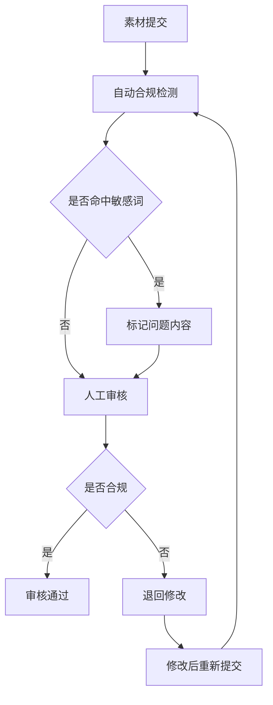

# 素材搜集清单与整理规范

版本：v5.0（去医疗化合规版）  
更新日期：2026年6月17日  
文档类型：素材管理

---

## 目录

1. [概述](#1-概述)
2. [素材分类体系](#2-素材分类体系)
3. [各类素材详细清单](#3-各类素材详细清单)
4. [素材整理模板](#4-素材整理模板)
5. [素材审核规范](#5-素材审核规范)
6. [素材存储与检索](#6-素材存储与检索)

---

## 1. 概述

### 1.1 目的
本清单用于规范后勤团队的素材搜集、整理和管理工作，确保平台内容的专业性、合规性和一致性。

### 1.2 适用范围
本清单适用于平台所有内容素材的搜集和整理，包括但不限于：文章、图片、视频、问答库、产品信息等。

### 1.3 合规原则
所有素材必须符合平台[合规定位与文案规范](compliance.md)，禁止涉及医疗诊断、治疗建议、药品推荐等医疗行为。

---

## 2. 素材分类体系

### 2.1 一级分类

| 分类编号 | 分类名称 | 说明 |
|---------|---------|------|
| M01 | 人体美学基础 | 面部特征、脸型、肤色、五官比例等基础知识 |
| M02 | 护肤与皮肤知识 | 肤质类型、护肤流程、常见皮肤问题等 |
| M03 | 化妆与美妆知识 | 妆容类型、化妆技巧、色彩搭配等 |
| M04 | 穿搭与风格知识 | 服装搭配、风格定位、体型优化等 |
| M05 | 发型与发色知识 | 发型推荐、发色搭配、发质护理等 |
| M06 | 营养与运动知识 | 饮食建议、运动指导、生活方式等 |
| M07 | 产品运营素材 | 活动文案、推广素材、用户激励等 |
| M08 | 合规素材 | 合规声明、用户协议、隐私政策等 |

---

## 3. 各类素材详细清单

### 3.1 M01 - 人体美学基础

#### 3.1.1 素材内容
| 子分类 | 内容描述 | 搜索关键词 |
|-------|---------|-----------|
| 脸型分类 | 椭圆形、圆形、方形、长形、心形、菱形脸特征描述 | 脸型分类、面部轮廓分析 |
| 五官特征 | 眼型、鼻型、唇型、眉型的分类与特征 | 五官分类、面部特征分析 |
| 肤色分类 | 冷白皮、暖黄皮、自然肤色等分类标准 | 肤色分类、肤色测试 |
| 面部比例 | 三庭五眼、黄金分割比例等美学标准 | 面部比例、美学标准 |

#### 3.1.2 整理要求
- 每种脸型/五官类型需提供：特征描述、适合的妆容/发型建议、避免的造型
- 肤色分类需提供：判定方法、适合的色彩、搭配建议

---

### 3.2 M02 - 护肤与皮肤知识

#### 3.2.1 素材内容
| 子分类 | 内容描述 | 搜索关键词 |
|-------|---------|-----------|
| 肤质类型 | 干性、油性、混合性、敏感性、中性肤质特征 | 肤质测试、皮肤类型 |
| 护肤流程 | 晨间护肤、晚间护肤、换季护肤流程 | 护肤步骤、日常护肤 |
| 常见皮肤问题 | 毛孔粗大、皮肤泛红凸起、黑眼圈、细纹等 | 皮肤护理、护肤建议 |
| 成分知识 | 常见护肤品成分及其功效 | 护肤品成分、成分分析 |

#### 3.2.2 整理要求
- 所有皮肤问题描述需使用合规用词，禁止使用"痘痘"、"痤疮"等医疗术语，统一使用"皮肤泛红凸起"
- 成分知识需标注"仅供参考"，不得涉及治疗功效
- 护肤建议需强调"个体差异"，避免绝对化表述

---

### 3.3 M03 - 化妆与美妆知识

#### 3.3.1 素材内容
| 子分类 | 内容描述 | 搜索关键词 |
|-------|---------|-----------|
| 妆容类型 | 日常妆、通勤妆、约会妆、派对妆等 | 妆容教程、化妆技巧 |
| 底妆技巧 | 粉底选择、遮瑕方法、定妆技巧 | 底妆教程、完美底妆 |
| 眼妆技巧 | 眼影配色、眼线画法、睫毛修饰 | 眼妆教程、眼妆技巧 |
| 唇妆技巧 | 口红选择、唇形修饰、持久方法 | 唇妆教程、口红搭配 |
| 色彩搭配 | 冷暖色调搭配、季节色彩选择 | 色彩搭配、美妆色彩 |

#### 3.3.2 整理要求
- 妆容教程需提供：适用场合、所需产品、步骤详解、注意事项
- 色彩搭配需结合肤色分类提供建议
- 所有教程需标注"效果因人而异"

---

### 3.4 M04 - 穿搭与风格知识

#### 3.4.1 素材内容
| 子分类 | 内容描述 | 搜索关键词 |
|-------|---------|-----------|
| 风格类型 | 甜美风、优雅风、干练风、休闲风、复古风等 | 风格定位、个人风格 |
| 体型优化 | 不同体型的穿搭建议 | 穿搭技巧、显瘦穿搭 |
| 场合穿搭 | 职场、约会、休闲、正式场合穿搭 | 场合着装、搭配指南 |
| 色彩搭配 | 服装色彩搭配原则 | 服装色彩、配色技巧 |

#### 3.4.2 整理要求
- 风格类型需提供：风格特征、代表元素、适合人群、避坑指南
- 体型优化需使用中性描述，避免"胖"、"瘦"等标签化用词
- 场合穿搭需明确适用场景

---

### 3.5 M05 - 发型与发色知识

#### 3.5.1 素材内容
| 子分类 | 内容描述 | 搜索关键词 |
|-------|---------|-----------|
| 发型推荐 | 按脸型、风格分类的发型建议 | 发型推荐、适合脸型的发型 |
| 发色搭配 | 按肤色、风格分类的发色建议 | 发色推荐、流行发色 |
| 发质护理 | 不同发质的护理方法 | 头发护理、发质保养 |
| 造型技巧 | 日常造型、特殊场合造型方法 | 发型教程、编发技巧 |

#### 3.5.2 整理要求
- 发型推荐需结合脸型和风格提供建议
- 发色搭配需标注"染发可能损伤发质，请做好护理"
- 造型技巧需提供详细步骤和所需工具

---

### 3.6 M06 - 营养与运动知识

#### 3.6.1 素材内容
| 子分类 | 内容描述 | 搜索关键词 |
|-------|---------|-----------|
| 饮食建议 | 护肤相关饮食、健康饮食习惯 | 美容饮食、健康饮食建议 |
| 运动指导 | 适合女性的运动方式、运动计划 | 女性运动、健身计划 |
| 生活方式 | 作息建议、压力管理、睡眠质量 | 健康生活、作息规律 |
| 营养知识 | 皮肤所需营养素、饮食搭配原则 | 营养学、美容营养 |

#### 3.6.2 整理要求
- 所有饮食建议需标注"仅供参考，不替代专业医疗建议"
- 运动指导需强调"循序渐进"，建议咨询专业教练
- 禁止使用"减肥"、"瘦身"等极端用词，使用"体态管理"、"身体状态优化"

---

### 3.7 M07 - 产品运营素材

#### 3.7.1 素材内容
| 子分类 | 内容描述 | 搜索关键词 |
|-------|---------|-----------|
| 活动文案 | 节日活动、促销活动、用户激励活动文案 | 活动策划、运营文案 |
| 推广素材 | 海报文案、社交媒体推广内容 | 推广文案、营销素材 |
| 用户激励 | 签到奖励、成就奖励、分享奖励文案 | 用户激励、积分规则 |
| 引导文案 | 新用户引导、功能引导、操作提示 | 用户引导、提示文案 |

#### 3.7.2 整理要求
- 所有文案需符合平台合规定位，禁止夸大宣传
- 活动规则需清晰明确，避免歧义
- 奖励描述需真实准确，不得虚假承诺

---

### 3.8 M08 - 合规素材

#### 3.8.1 素材内容
| 子分类 | 内容描述 | 搜索关键词 |
|-------|---------|-----------|
| 合规声明 | 通用声明、AI顾问声明、产品推荐声明 | 合规声明、免责声明 |
| 用户协议 | 用户注册协议、服务条款 | 用户协议、服务条款 |
| 隐私政策 | 数据收集说明、数据使用规范 | 隐私政策、数据保护 |
| 文案规范 | 合规用词对照表、禁止用语列表 | 文案规范、合规用词 |

#### 3.8.2 整理要求
- 合规声明需放置在显著位置
- 用户协议和隐私政策需定期更新
- 文案规范需同步到所有内容创作者

---

## 4. 素材整理模板

### 4.1 通用素材模板

```
【素材标题】
【分类】M01/M02/M03/...
【来源】原创/转载（需注明出处）
【适用模块】变美分析/姿造美学/生活美学计划/...
【合规审核】已通过/待审核
【创建时间】YYYY-MM-DD
【更新时间】YYYY-MM-DD

【内容正文】
...

【注意事项】
- 合规声明：本内容仅供参考，不能替代专业医疗建议
- 适用人群：...
- 避免事项：...
```

### 4.2 图片素材模板

```
【图片标题】
【分类】M01/M02/M03/...
【来源】原创拍摄/授权使用/正版图库
【尺寸】宽×高
【格式】JPG/PNG
【适用场景】分析报告/推荐卡片/海报制作
【合规审核】已通过/待审核
【创建时间】YYYY-MM-DD
【备注】...
```

### 4.3 视频素材模板

```
【视频标题】
【分类】M01/M02/M03/...
【来源】原创制作/授权使用
【时长】XX:XX
【分辨率】1080P/720P
【格式】MP4
【适用场景】教程展示/产品介绍/用户案例
【合规审核】已通过/待审核
【创建时间】YYYY-MM-DD
【备注】...
```

---

## 4.5 素材生成规则

> **素材来源规范**：预设素材库全部AI生成，不出现真人照片。

| 规则 | 说明 |
|------|------|
| 图片类型 | AI生成图片，禁止使用真人照片 |
| 人物形象 | 使用虚拟模特或插画风格 |
| 产品图片 | 使用AI渲染产品图，禁止使用真人模特展示 |
| 来源标注 | 所有素材需标注"AI生成" |
| 版权合规 | 使用有版权的AI生成平台 |

---

## 5. 素材审核规范

### 5.1 审核流程



### 5.2 审核要点

| 审核维度 | 审核内容 |
|---------|---------|
| 医疗术语 | 禁止使用"诊断"、"治疗"、"治愈"、"药品"等医疗术语 |
| 疗效承诺 | 禁止使用"保证"、"一定"、"100%"等承诺性词汇 |
| 虚假宣传 | 内容需真实准确，不得夸大效果 |
| 版权合规 | 图片、视频需有合法使用授权 |
| 用户隐私 | 不得包含用户个人信息 |
| 用词规范 | 需符合平台文案规范，如"痘痘"→"皮肤泛红凸起" |

### 5.3 敏感词列表

| 类别 | 敏感词 |
|------|-------|
| 医疗诊断 | 诊断、确诊、患有、疾病、病症、症状 |
| 治疗建议 | 治疗、治愈、根治、疗效、药方、处方 |
| 药品推荐 | 药、药品、药物、药膏、口服药 |
| 医美项目 | 整形、手术、注射、填充、吸脂、线雕 |
| 疗效承诺 | 保证、一定、100%、立刻见效、永久有效 |
| 身体标签 | 胖、瘦、丑、美丑、减肥、瘦身 |

---

## 6. 素材存储与检索

### 6.1 存储结构

```
materials/
├── M01-body-aesthetics/
│   ├── images/
│   ├── articles/
│   └── videos/
├── M02-skin-care/
│   ├── images/
│   ├── articles/
│   └── videos/
├── M03-makeup/
│   ├── images/
│   ├── articles/
│   └── videos/
├── M04-fashion/
│   ├── images/
│   ├── articles/
│   └── videos/
├── M05-hair/
│   ├── images/
│   ├── articles/
│   └── videos/
├── M06-nutrition/
│   ├── images/
│   ├── articles/
│   └── videos/
├── M07-operation/
│   ├── copywriting/
│   ├── posters/
│   └── templates/
└── M08-compliance/
    ├── statements/
    ├── agreements/
    └── policies/
```

### 6.2 检索规范

| 检索维度 | 说明 |
|---------|------|
| 分类检索 | 按一级分类(M01-M08)检索 |
| 标签检索 | 按子分类标签检索 |
| 关键词检索 | 按标题、内容关键词检索 |
| 适用场景检索 | 按适用模块检索 |
| 审核状态检索 | 按审核状态检索 |

---

**文档审批：**
- 产品负责人：___________
- 内容负责人：___________
- 法务负责人：___________