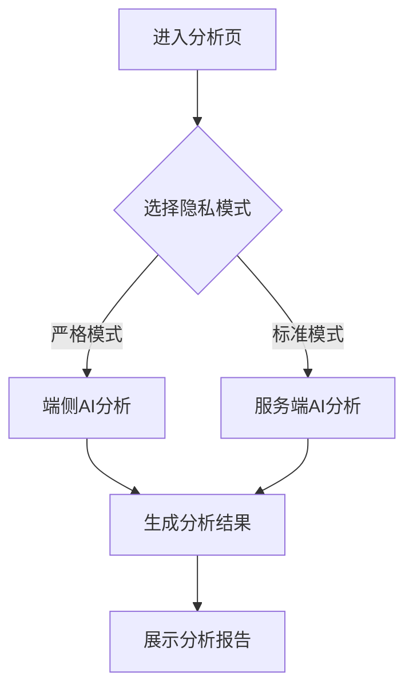
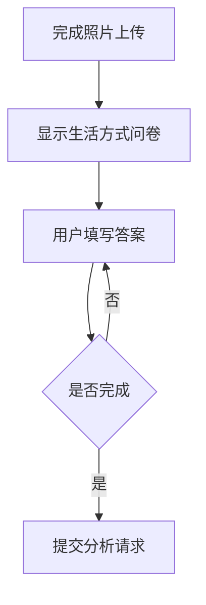
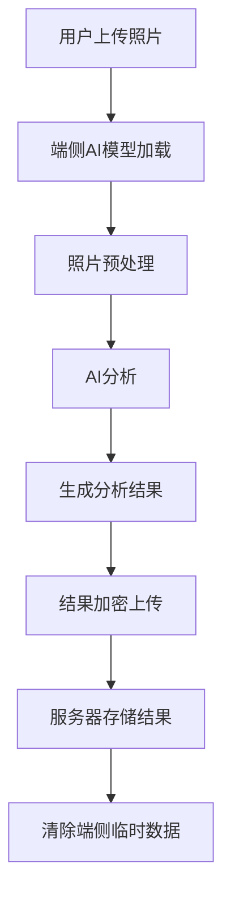
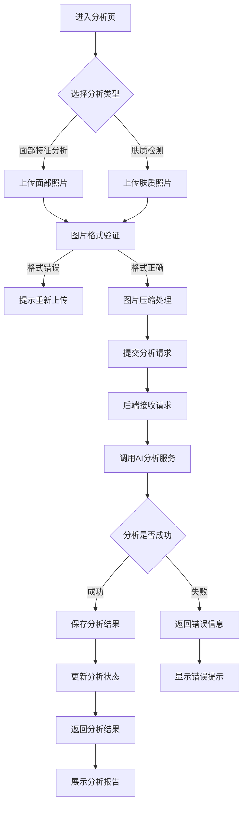
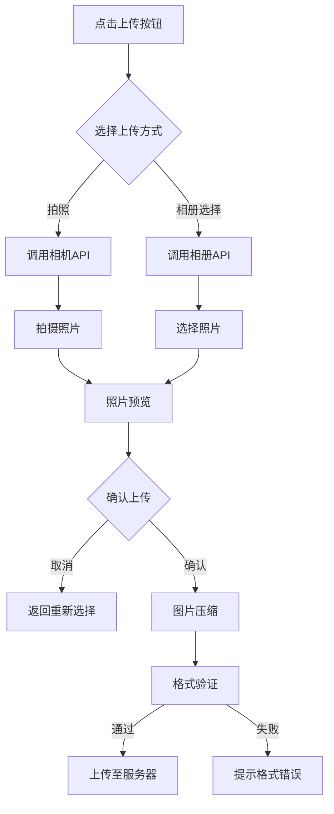
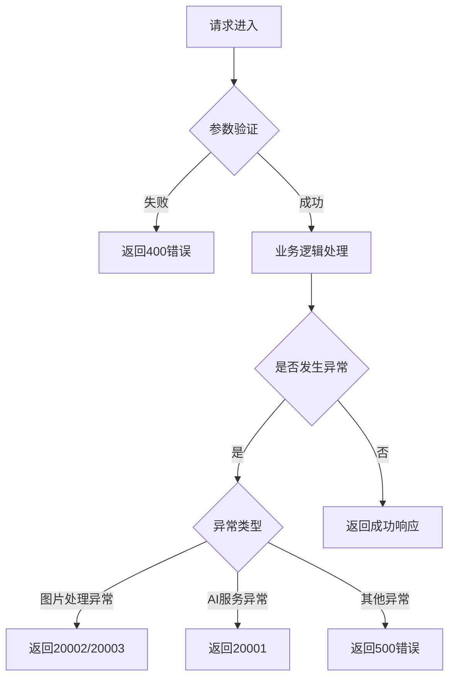

# 模块一：变美分析 - 详细设计文档

版本：v5.1（功能完善版）
更新日期：2026年7月8日
所属模块：变美分析

---

## 目录

1. [功能概述](#1-功能概述)
2. [业务流程](#2-业务流程)
3. [页面设计](#3-页面设计)
4. [接口设计](#4-接口设计)
5. [数据模型](#5-数据模型)
6. [前端实现](#6-前端实现)
7. [后端实现](#7-后端实现)
8. [异常处理](#8-异常处理)
9. [合规定制](#9-合规定制)

---

## 合规约束

> **引用文档**：[合规定位与文案规范](../compliance.md)
>
> **合规红线**：
> - 禁止使用"诊断"、"治疗"、"治愈"等医疗术语
> - 禁止推荐药品或医美项目
> - 所有分析结果需标注"仅供参考，不能替代专业医疗建议"
> - 皮肤问题描述需使用合规用词（如"皮肤泛红凸起"代替"痘痘"）
> - 分析报告需包含显式的合规声明

---

## 1. 功能概述

### 1.1 模块定位
变美分析模块是「悦己颜值社」的核心功能模块之一，基于AI技术对用户面部特征和肤质进行科学分析，生成个性化分析报告，为后续的个性化推荐提供数据基础。

### 1.2 核心功能

| 功能点 | 描述 | 优先级 |
|-------|------|--------|
| 多角度照片上传 | 支持上传正脸（必需）、左脸（推荐）、右脸（推荐）、俯视（选填）、仰视（选填）、全身（推荐）照片 | P0 |
| 面部特征分析 | 分析五官比例、脸型、肤色等特征 | P0 |
| 肤质检测 | 检测肤质类型、毛孔、色斑、黑眼圈等问题 | P0 |
| 皮肤问题详细分析 | 分析痘痘问题、肤质干燥、毛孔粗大等具体问题及程度 | P0 |
| 身形问题分析 | 分析腰围赘肉、大腿粗壮、身形比例等具体问题 | P0 |
| 分析报告生成 | 生成详细的分析报告，包含改善建议 | P0 |
| 报告标签式导航 | 报告采用标签式导航，分为面部形体分析、妆容、穿搭、发型、美容美体五个功能区 | P0 |
| 妆容推荐 | 每条推荐包含详细描述和查看效果图按钮 | P0 |
| 穿搭推荐 | 每条推荐包含详细描述、搭配发型建议和查看效果图按钮 | P0 |
| 发型推荐 | 每条推荐包含详细描述、与理发师沟通话术和查看效果图按钮 | P0 |
| 美容美体周期计划 | 分三个周期，每个周期包含解决问题和目标，提供查看当前周期计划按钮 | P0 |
| 当场生成报告一致性 | 上传照片后当场生成的报告与个人中心我的报告内容一致 | P0 |
| 历史记录 | 保存多次分析记录，支持对比查看 | P1 |
| 隐私模式选择 | 支持严格模式（端侧处理）/标准模式（服务端处理） | P0 |
| 生活方式问卷 | 用户填写生活方式相关问卷，为分析提供更多维度数据 | P0 |
| 端侧AI处理 | 支持在用户设备端进行AI分析，保护用户隐私 | P1 |

### 1.3 功能流程图

```
用户进入分析页 → 选择隐私模式 → 选择分析类型 → 上传/拍摄照片 → 填写生活方式问卷 → 提交分析 → AI处理（端侧/服务端）→ 生成报告 → 查看详情
```

### 1.4 隐私模式选择

#### 1.4.1 模式定义

| 模式 | 说明 | 适用场景 |
|------|------|---------|
| 严格模式 | 用户照片仅在端侧处理，不上传服务器 | 对隐私要求极高的用户 |
| 标准模式 | 用户照片上传至服务器进行分析 | 希望获得完整分析功能的用户 |

#### 1.4.2 模式切换流程



#### 1.4.3 模式对比

| 维度 | 严格模式 | 标准模式 |
|------|---------|---------|
| 照片存储 | 不上传服务器 | 加密存储于服务器 |
| 分析能力 | 端侧AI分析，功能有限 | 完整AI分析能力 |
| 个性化推荐 | 基于端侧数据 | 基于完整数据 |
| 数据安全 | 最高，数据不上传 | 较高，加密存储 |

### 1.5 生活方式问卷

#### 1.5.1 问卷内容

| 问题类别 | 问题描述 | 选项示例 |
|---------|---------|---------|
| 作息习惯 | 您通常几点入睡？ | 22点前/22-24点/24点后 |
| 饮食偏好 | 您的饮食口味偏好？ | 清淡/适中/偏重口味 |
| 运动习惯 | 您每周运动次数？ | 几乎不运动/1-2次/3-4次/5次以上 |
| 护肤习惯 | 您每天的护肤步骤？ | 仅洁面/基础护肤/完整护肤 |
| 压力水平 | 您近期的压力感受？ | 轻松/一般/较大/很大 |

#### 1.5.2 问卷流程



### 1.6 端侧AI处理逻辑

#### 1.6.1 处理流程



#### 1.6.2 端侧处理步骤

| 步骤 | 说明 | 安全措施 |
|------|------|---------|
| 模型加载 | 从CDN加载AI模型 | 验证模型完整性和签名 |
| 照片预处理 | 调整尺寸、格式转换 | 本地处理，不上传原始照片 |
| AI分析 | 提取面部特征、分析肤质 | 仅保留分析结果，不保留原始数据 |
| 结果加密 | 使用用户公钥加密结果 | 确保传输安全 |
| 数据清除 | 清除端侧临时数据 | 使用安全擦除算法 |

---

## 2. 业务流程

### 2.1 分析流程



### 2.2 照片上传流程



---

## 3. 页面设计

### 3.1 页面清单

| 页面路径 | 页面名称 | 说明 |
|---------|---------|------|
| /analysis | 分析首页 | 选择分析类型，上传照片 |
| /analysis/result | 分析结果页 | 展示分析报告详情 |

### 3.2 分析首页设计

#### 3.2.1 布局结构

```
┌─────────────────────────────────────────────┐
│              顶部导航栏                      │
├─────────────────────────────────────────────┤
│                                             │
│         ┌─────────────────────┐            │
│         │                     │            │
│         │   上传照片区域       │            │
│         │   （点击上传/拍照）   │            │
│         │                     │            │
│         └─────────────────────┘            │
│                                             │
│         ┌─────────┐  ┌─────────┐           │
│         │ 面部分析 │  │ 肤质检测 │           │
│         └─────────┘  └─────────┘           │
│                                             │
│         ┌─────────────────────┐            │
│         │   历史分析记录       │            │
│         │   （最近3条）         │            │
│         └─────────────────────┘            │
│                                             │
└─────────────────────────────────────────────┘
```

#### 3.2.2 交互设计

| 交互元素 | 触发方式 | 响应动作 |
|---------|---------|---------|
| 上传区域 | 点击 | 弹出选择框，支持拍照/相册选择 |
| 分析类型按钮 | 点击 | 切换分析类型（面部/肤质） |
| 历史记录卡片 | 点击 | 跳转到分析结果页 |
| 开始分析按钮 | 点击 | 提交分析请求，显示加载动画 |

### 3.3 分析结果页设计

#### 3.3.1 布局结构

```
┌─────────────────────────────────────────────┐
│              顶部导航栏                      │
├─────────────────────────────────────────────┤
│                                             │
│         ┌─────────────────────┐            │
│         │   原始照片展示       │            │
│         └─────────────────────┘            │
│                                             │
│         ┌─────────────────────┐            │
│         │   综合评分           │            │
│         │     85.5分          │            │
│         └─────────────────────┘            │
│                                             │
│         ┌─────────────────────┐            │
│         │   脸型分析           │            │
│         │   椭圆形脸           │            │
│         └─────────────────────┘            │
│                                             │
│         ┌─────────────────────┐            │
│         │   肤质类型           │            │
│         │   干性皮肤           │            │
│         └─────────────────────┘            │
│                                             │
│         ┌─────────────────────┐            │
│         │   皮肤问题分析       │            │
│         │   • 毛孔粗大         │            │
│         │   • 轻微色斑         │            │
│         └─────────────────────┘            │
│                                             │
│         ┌─────────────────────┐            │
│         │   改善建议           │            │
│         │   • 注意防晒         │            │
│         │   • 使用保湿产品     │            │
│         └─────────────────────┘            │
│                                             │
└─────────────────────────────────────────────┘
```

---

## 4. 接口设计

### 4.1 接口清单

| API路径 | 方法 | 说明 | 认证 |
|---------|------|------|------|
| /api/v1/analyses | POST | 创建分析 | 是 |
| /api/v1/analyses | GET | 获取分析记录列表 | 是 |
| /api/v1/analyses/{id} | GET | 获取分析结果详情 | 是 |

### 4.2 创建分析接口

**POST** `/api/v1/analyses`

请求体（multipart/form-data）：
```
image: <文件>
analysis_type: 1
```

| 字段 | 类型 | 必填 | 说明 |
|------|------|------|------|
| image | FILE | 是 | 分析图片（JPG/PNG，≤10MB） |
| analysis_type | INT | 是 | 分析类型（1面部特征分析，2肤质检测） |

成功响应：
```json
{
  "code": 200,
  "message": "分析已提交",
  "data": {
    "id": "uuid",
    "user_id": "uuid",
    "image_url": "url",
    "analysis_type": 1,
    "status": 0,
    "created_at": "2026-06-17T10:00:00Z"
  },
  "timestamp": 1700000000000
}
```

### 4.3 获取分析结果接口

**GET** `/api/v1/analyses/{id}`

成功响应：
```json
{
  "code": 200,
  "message": "success",
  "data": {
    "analysis": {
      "id": "uuid",
      "user_id": "uuid",
      "image_url": "url",
      "analysis_type": 1,
      "status": 1,
      "created_at": "2026-06-17T10:00:00Z",
      "completed_at": "2026-06-17T10:01:00Z"
    },
    "result": {
      "face_shape": "椭圆形",
      "skin_type": 2,
      "skin_problems": ["毛孔粗大", "轻微色斑"],
      "complexion": "白皙",
      "features": {
        "eye_shape": "杏仁眼",
        "nose_shape": "直鼻",
        "lip_shape": "樱桃唇"
      },
      "suggestions": {
        "skincare": ["注意防晒", "使用保湿产品"],
        "makeup": ["适合自然妆容", "推荐暖色调"]
      },
      "score": 85.5
    }
  },
  "timestamp": 1700000000000
}
```

---

## 5. 数据模型

### 5.1 analyses 表

| 字段名 | 类型 | 约束 | 说明 |
|-------|------|------|------|
| id | UUID | PRIMARY KEY | 分析记录ID |
| user_id | UUID | FOREIGN KEY | 用户ID |
| image_url | VARCHAR(500) | NOT NULL | 分析图片URL |
| analysis_type | SMALLINT | NOT NULL | 分析类型（1面部，2肤质） |
| status | SMALLINT | DEFAULT 0 | 状态（0处理中，1成功，2失败） |
| created_at | TIMESTAMP | DEFAULT CURRENT_TIMESTAMP | 创建时间 |
| completed_at | TIMESTAMP | | 完成时间 |

### 5.2 analysis_results 表

| 字段名 | 类型 | 约束 | 说明 |
|-------|------|------|------|
| id | UUID | PRIMARY KEY | 主键 |
| analysis_id | UUID | FOREIGN KEY, UNIQUE | 分析记录ID |
| face_shape | VARCHAR(50) | | 脸型 |
| skin_type | SMALLINT | | 肤质类型 |
| skin_problems | TEXT[] | | 皮肤问题数组 |
| complexion | VARCHAR(50) | | 肤色 |
| features | JSONB | | 面部特征详细数据 |
| suggestions | JSONB | | 改善建议 |
| score | DECIMAL(5,2) | | 综合评分 |
| created_at | TIMESTAMP | DEFAULT CURRENT_TIMESTAMP | 创建时间 |

---

## 6. 前端实现

### 6.1 组件结构

```
analysis/
├── page.tsx                  # 分析首页
├── result/
│   └── page.tsx              # 分析结果页
└── components/
    ├── ImageUploader.tsx     # 图片上传组件
    ├── AnalysisTypeSelector.tsx  # 分析类型选择器
    ├── AnalysisCard.tsx      # 分析记录卡片
    ├── AnalysisResult.tsx    # 分析结果展示组件
    └── LoadingOverlay.tsx    # 加载遮罩组件
```

### 6.2 关键代码示例

#### 6.2.1 图片上传组件

```typescript
interface ImageUploaderProps {
  onImageSelect: (file: File) => void;
  disabled?: boolean;
}

const ImageUploader = ({ onImageSelect, disabled }: ImageUploaderProps) => {
  const handleFileChange = (e: React.ChangeEvent<HTMLInputElement>) => {
    const file = e.target.files?.[0];
    if (file) {
      validateAndCompress(file).then(onImageSelect);
    }
  };

  const handleCameraClick = () => {
    // 调用相机API
  };

  return (
    <div className="upload-area" onClick={!disabled ? handleCameraClick : undefined}>
      <input type="file" accept="image/jpeg,image/png" onChange={handleFileChange} />
      <div className="upload-placeholder">
        <CameraIcon />
        <span>点击上传或拍照</span>
      </div>
    </div>
  );
};
```

#### 6.2.2 分析提交逻辑

```typescript
const submitAnalysis = async (image: File, type: number) => {
  setLoading(true);
  try {
    const formData = new FormData();
    formData.append('image', image);
    formData.append('analysis_type', type.toString());

    const response = await axios.post('/api/v1/analyses', formData, {
      headers: { 'Content-Type': 'multipart/form-data' }
    });

    router.push(`/analysis/result?id=${response.data.data.id}`);
  } catch (error) {
    showError('分析提交失败，请重试');
  } finally {
    setLoading(false);
  }
};
```

---

## 7. 后端实现

### 7.1 目录结构

```
modules/analysis/
├── analysis.module.ts
├── analysis.controller.ts
├── analysis.service.ts
├── analysis.entity.ts
├── analysis.dto.ts
└── analysis.repository.ts
```

### 7.2 核心逻辑

#### 7.2.1 分析服务实现

```typescript
@Injectable()
export class AnalysisService {
  constructor(
    @InjectRepository(Analysis)
    private analysisRepository: AnalysisRepository,
    private aiProvider: AiProvider,
    private ossProvider: OssProvider
  ) {}

  async createAnalysis(userId: string, image: File, type: number): Promise<Analysis> {
    const imageUrl = await this.ossProvider.upload(image);

    const analysis = this.analysisRepository.create({
      userId,
      imageUrl,
      analysisType: type,
      status: AnalysisStatus.PENDING
    });

    await this.analysisRepository.save(analysis);

    this.processAnalysis(analysis.id);

    return analysis;
  }

  private async processAnalysis(analysisId: string) {
    const analysis = await this.analysisRepository.findOneBy({ id: analysisId });
    if (!analysis) return;

    try {
      const result = await this.aiProvider.analyzeImage(analysis.imageUrl, analysis.analysisType);

      const analysisResult = new AnalysisResult();
      analysisResult.analysisId = analysisId;
      analysisResult.faceShape = result.face_shape;
      analysisResult.skinType = result.skin_type;
      analysisResult.skinProblems = result.skin_problems;
      analysisResult.complexion = result.complexion;
      analysisResult.features = result.features;
      analysisResult.suggestions = result.suggestions;
      analysisResult.score = result.score;

      await this.analysisResultRepository.save(analysisResult);

      analysis.status = AnalysisStatus.SUCCESS;
      analysis.completedAt = new Date();
      await this.analysisRepository.save(analysis);
    } catch (error) {
      analysis.status = AnalysisStatus.FAILED;
      analysis.completedAt = new Date();
      await this.analysisRepository.save(analysis);
    }
  }
}
```

---

## 8. 异常处理

### 8.1 错误码定义

| 错误码 | 说明 | 处理方式 |
|-------|------|---------|
| 20001 | 分析处理失败 | 提示用户重试 |
| 20002 | 图片格式错误 | 提示用户上传JPG/PNG格式 |
| 20003 | 图片大小超出限制 | 提示用户上传≤10MB的图片 |
| 20004 | 分析记录不存在 | 返回404页面 |
| 20005 | 分析正在处理中 | 提示用户等待 |

### 8.2 异常处理流程



---

## 9. 合规定制

### 9.1 合规声明

在分析结果页面必须显示以下合规声明：

> "本分析结果仅供参考，不能替代专业医疗建议。如有皮肤问题，请咨询专业皮肤科医生。"

### 9.2 禁止内容

| 禁止内容 | 说明 |
|---------|------|
| 医疗诊断术语 | 禁止使用"诊断"、"治疗"等医疗术语 |
| 疗效承诺 | 禁止承诺治疗效果 |
| 医美推荐 | 禁止推荐医美项目 |
| 药品推荐 | 禁止推荐药品 |

### 9.3 文案规范

| 推荐用词 | 禁止用词 |
|---------|---------|
| 分析/检测 | 诊断/检查 |
| 建议/参考 | 治疗/方案 |
| 改善/提升 | 治愈/根治 |
| 注意事项 | 医嘱/处方 |

---

**文档审批：**
- 产品负责人：___________
- 技术负责人：___________
