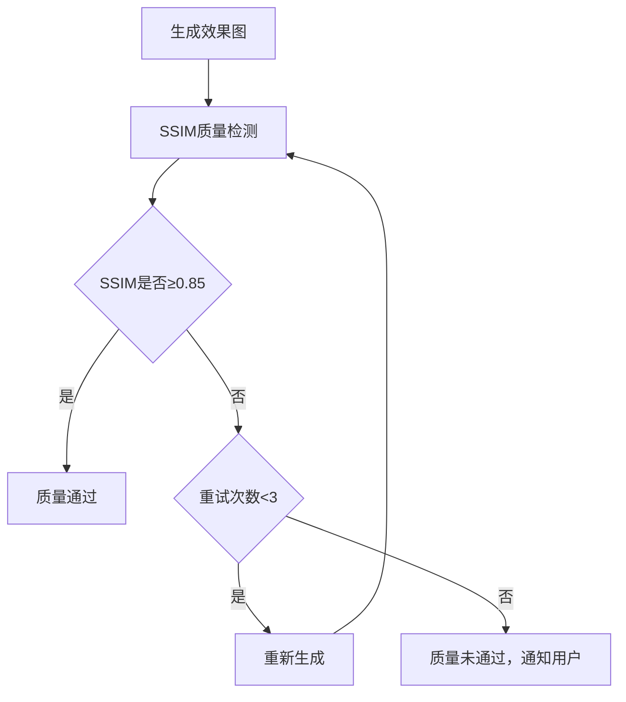
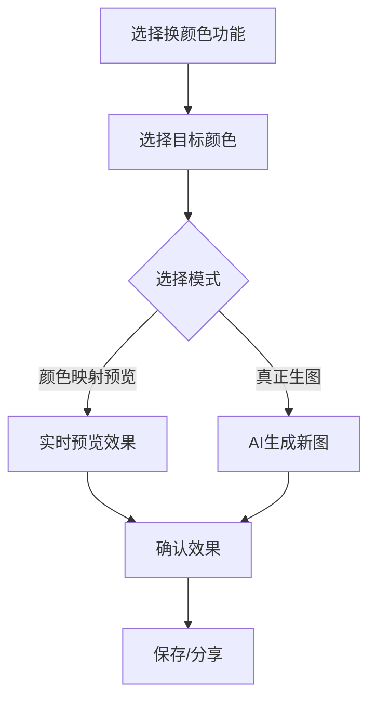
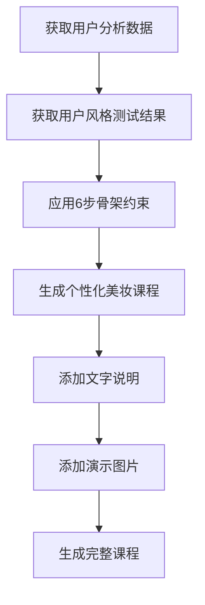
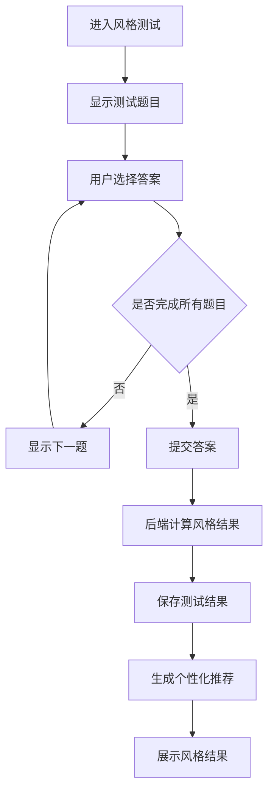
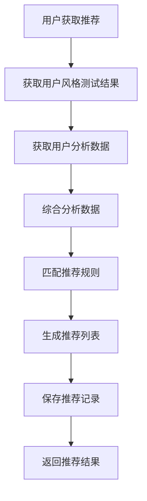

# 模块二：姿造美学 - 详细设计文档

版本：v5.0（去医疗化合规版）
更新日期：2026年6月17日
所属模块：姿造美学

---

## 目录

1. [功能概述](#1-功能概述)
2. [业务流程](#2-业务流程)
3. [页面设计](#3-页面设计)
4. [接口设计](#4-接口设计)
5. [数据模型](#5-数据模型)
6. [前端实现](#6-前端实现)
7. [后端实现](#7-后端实现)
8. [异常处理](#8-异常处理)

---

## 合规约束

> **引用文档**：[合规定位与文案规范](../compliance.md)
>
> **合规红线**：
> - 禁止使用"治疗"、"治愈"等医疗术语描述妆容效果
> - 禁止推荐药品或医美项目
> - 妆容推荐需标注"效果因人而异"
> - 禁止使用"完美"、"100%有效"等承诺性词汇
> - 换颜色功能需标注"染发可能损伤发质，请做好护理"

---

## 1. 功能概述

### 1.1 模块定位
姿造美学模块基于用户的风格偏好和面部特征分析结果，提供个性化的造型推荐和穿搭指导，帮助用户发现适合自己的个人风格。

### 1.2 核心功能

| 功能点 | 描述 | 优先级 |
|-------|------|--------|
| 风格测试 | 通过问卷测试用户风格偏好 | P0 |
| 造型推荐 | 根据分析结果推荐适合的发型、妆容 | P0 |
| 穿搭指导 | 根据体型和风格推荐服装搭配 | P1 |
| 虚拟试妆 | 支持虚拟试妆功能，预览效果 | P2 |
| 收藏夹 | 用户收藏喜欢的造型计划 | P1 |
| 效果图缓存策略 | 缓存生图结果，提升用户体验 | P1 |
| 效果图质量保障 | SSIM阈值检测+三次重试机制 | P0 |
| 换颜色功能 | 颜色映射预览+真正生图两种模式 | P0 |
| 专属美妆课程自动生成 | 6步骨架约束自动生成个性化美妆课程 | P1 |

### 1.3 功能流程图

```
用户进入姿造美学 → 风格测试 → 获取风格结果 → 查看造型推荐 → 收藏计划/虚拟试妆/生成美妆课程
```

### 1.4 效果图缓存策略

#### 1.4.1 缓存层级

| 层级 | 存储位置 | 有效期 | 说明 |
|------|---------|--------|------|
| L1 | 用户设备本地存储 | 7天 | 缓存用户最近查看的效果图 |
| L2 | CDN缓存 | 30天 | 缓存热门效果图 |
| L3 | 对象存储 | 永久 | 存储所有生成的效果图 |

#### 1.4.2 缓存策略

| 场景 | 处理方式 |
|------|---------|
| 用户首次查看 | 生成新图，存入三级缓存 |
| 用户再次查看相同风格 | 从L1缓存读取 |
| 其他用户查看相同风格 | 从L2缓存读取 |
| 缓存过期 | 重新生成并更新缓存 |

### 1.5 效果图质量保障

#### 1.5.1 SSIM阈值检测

| 参数 | 值 | 说明 |
|------|------|------|
| SSIM阈值 | ≥0.85 | 结构相似性指数阈值 |
| 检测次数 | 3次 | 超过阈值则通过 |
| 重试间隔 | 5秒 | 重试之间的等待时间 |

#### 1.5.2 质量保障流程



### 1.6 换颜色功能

#### 1.6.1 功能模式

| 模式 | 说明 | 特点 |
|------|------|------|
| 颜色映射预览 | 在原图基础上进行颜色替换 | 快速预览，效果有限 |
| 真正生图 | 使用AI重新生成带有目标颜色的图片 | 效果逼真，耗时较长 |

#### 1.6.2 颜色选择器

| 功能 | 说明 |
|------|------|
| 预设颜色 | 提供常用发色/妆容色预设 |
| 自定义颜色 | 支持用户自定义颜色 |
| 颜色推荐 | 根据用户肤色推荐适合的颜色 |

#### 1.6.3 处理流程



### 1.7 专属美妆课程自动生成

#### 1.7.1 6步骨架约束

| 步骤 | 内容 | 说明 |
|------|------|------|
| 第1步 | 肤质分析 | 根据用户肤质选择适合的底妆产品 |
| 第2步 | 面部轮廓 | 根据脸型推荐修容方法 |
| 第3步 | 眼妆技巧 | 根据眼型推荐眼妆画法 |
| 第4步 | 唇妆选择 | 根据肤色和风格推荐唇色 |
| 第5步 | 定妆方法 | 推荐适合的定妆产品和方法 |
| 第6步 | 整体调整 | 根据风格进行整体妆容调整 |

#### 1.7.2 课程生成流程



---

## 2. 业务流程

### 2.1 风格测试流程



### 2.2 推荐生成流程



---

## 3. 页面设计

### 3.1 页面清单

| 页面路径 | 页面名称 | 说明 |
|---------|---------|------|
| /style | 姿造美学首页 | 展示风格测试入口和推荐列表 |
| /style/test | 风格测试页 | 完成风格测试问卷 |
| /style/recommendation | 造型推荐页 | 查看个性化造型推荐 |

### 3.2 风格测试页设计

#### 3.2.1 布局结构

```
┌─────────────────────────────────────────────┐
│              顶部导航栏                      │
├─────────────────────────────────────────────┤
│                                             │
│         ┌─────────────────────┐            │
│         │   进度条 3/10        │            │
│         └─────────────────────┘            │
│                                             │
│         ┌─────────────────────┐            │
│         │                     │            │
│         │   问题描述           │            │
│         │   你更喜欢哪种风格？  │            │
│         │                     │            │
│         └─────────────────────┘            │
│                                             │
│         ┌──────┐ ┌──────┐ ┌──────┐        │
│         │ 甜美 │ │ 优雅 │ │ 干练 │        │
│         └──────┘ └──────┘ └──────┘        │
│                                             │
│         ┌──────────────┐                   │
│         │   下一题      │                   │
│         └──────────────┘                   │
│                                             │
└─────────────────────────────────────────────┘
```

### 3.3 造型推荐页设计

#### 3.3.1 布局结构

```
┌─────────────────────────────────────────────┐
│              顶部导航栏                      │
├─────────────────────────────────────────────┤
│                                             │
│         ┌──────┐ ┌──────┐ ┌──────┐        │
│         │ 发型 │ │ 妆容 │ │ 穿搭 │        │
│         └──────┘ └──────┘ └──────┘        │
│                                             │
│         ┌─────────────────────┐            │
│         │                     │            │
│         │   推荐卡片1         │            │
│         │   空气刘海          │            │
│         │   [图片]            │            │
│         │   适合椭圆脸型       │            │
│         └─────────────────────┘            │
│                                             │
│         ┌─────────────────────┐            │
│         │                     │            │
│         │   推荐卡片2         │            │
│         │   自然妆容          │            │
│         │   [图片]            │            │
│         │   适合干性皮肤       │            │
│         └─────────────────────┘            │
│                                             │
└─────────────────────────────────────────────┘
```

---

## 4. 接口设计

### 4.1 接口清单

| API路径 | 方法 | 说明 | 认证 |
|---------|------|------|------|
| /api/v1/style/test | POST | 创建风格测试 | 是 |
| /api/v1/style/test/{id} | GET | 获取测试结果 | 是 |
| /api/v1/style/recommendations | GET | 获取推荐列表 | 是 |
| /api/v1/style/recommendations/{id} | GET | 获取推荐详情 | 是 |

### 4.2 创建风格测试接口

**POST** `/api/v1/style/test`

请求体：
```json
{
  "answers": {
    "q1": "A",
    "q2": "B",
    "q3": "A",
    "q4": "C",
    "q5": "B"
  }
}
```

成功响应：
```json
{
  "code": 200,
  "message": "测试已提交",
  "data": {
    "id": "uuid",
    "user_id": "uuid",
    "answers": {...},
    "status": 1,
    "created_at": "2026-06-17T10:00:00Z",
    "completed_at": "2026-06-17T10:00:30Z",
    "result": {
      "personal_style": "甜美优雅",
      "style_description": "你的风格偏向甜美优雅",
      "style_tags": ["甜美", "优雅", "温柔"]
    }
  },
  "timestamp": 1700000000000
}
```

---

## 5. 数据模型

### 5.1 style_tests 表

| 字段名 | 类型 | 约束 | 说明 |
|-------|------|------|------|
| id | UUID | PRIMARY KEY | 主键 |
| user_id | UUID | FOREIGN KEY | 用户ID |
| answers | JSONB | NOT NULL | 测试答案 |
| status | SMALLINT | DEFAULT 0 | 状态 |
| created_at | TIMESTAMP | DEFAULT CURRENT_TIMESTAMP | 创建时间 |
| completed_at | TIMESTAMP | | 完成时间 |

### 5.2 style_results 表

| 字段名 | 类型 | 约束 | 说明 |
|-------|------|------|------|
| id | UUID | PRIMARY KEY | 主键 |
| test_id | UUID | FOREIGN KEY, UNIQUE | 测试ID |
| personal_style | VARCHAR(50) | NOT NULL | 个人风格 |
| style_description | TEXT | | 风格描述 |
| style_tags | TEXT[] | | 风格标签 |
| created_at | TIMESTAMP | DEFAULT CURRENT_TIMESTAMP | 创建时间 |

### 5.3 recommendations 表

| 字段名 | 类型 | 约束 | 说明 |
|-------|------|------|------|
| id | UUID | PRIMARY KEY | 主键 |
| user_id | UUID | FOREIGN KEY | 用户ID |
| result_id | UUID | FOREIGN KEY | 风格测试结果ID |
| recommendation_type | SMALLINT | NOT NULL | 推荐类型 |
| content | JSONB | NOT NULL | 推荐内容 |
| image_url | VARCHAR(500) | | 推荐图片URL |
| created_at | TIMESTAMP | DEFAULT CURRENT_TIMESTAMP | 创建时间 |

---

## 6. 前端实现

### 6.1 组件结构

```
style/
├── page.tsx                  # 姿造美学首页
├── test/
│   └── page.tsx              # 风格测试页
├── recommendation/
│   └── page.tsx              # 造型推荐页
└── components/
    ├── StyleTestQuestion.tsx # 测试题目组件
    ├── StyleResultCard.tsx   # 风格结果卡片
    ├── RecommendCard.tsx     # 推荐卡片组件
    └── StyleTabs.tsx         # 类型切换标签
```

---

## 7. 后端实现

### 7.1 目录结构

```
modules/style/
├── style.module.ts
├── style.controller.ts
├── style.service.ts
├── style.entity.ts
├── style.dto.ts
└── style.repository.ts
```

### 7.2 核心逻辑

```typescript
@Injectable()
export class StyleService {
  constructor(
    @InjectRepository(StyleTest)
    private styleTestRepository: StyleTestRepository,
    @InjectRepository(Recommendation)
    private recommendationRepository: RecommendationRepository
  ) {}

  async createStyleTest(userId: string, answers: Record<string, string>): Promise<StyleTest> {
    const test = this.styleTestRepository.create({
      userId,
      answers,
      status: 0
    });

    await this.styleTestRepository.save(test);

    const result = this.calculateStyleResult(answers);

    const styleResult = new StyleResult();
    styleResult.testId = test.id;
    styleResult.personalStyle = result.personalStyle;
    styleResult.styleDescription = result.description;
    styleResult.styleTags = result.tags;

    await this.styleResultRepository.save(styleResult);

    await this.generateRecommendations(userId, test.id, result);

    test.status = 1;
    test.completedAt = new Date();

    return this.styleTestRepository.save(test);
  }
}
```

---

## 8. 异常处理

| 错误码 | 说明 | 处理方式 |
|-------|------|---------|
| 30001 | 测试不存在 | 返回404页面 |
| 30002 | 答案不完整 | 提示用户完成所有题目 |
| 30003 | 推荐生成失败 | 提示用户重试 |

---

**文档审批：**
- 产品负责人：___________
- 技术负责人：___________
