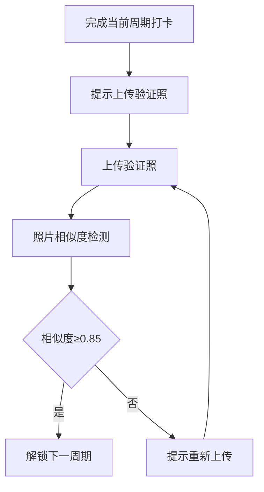
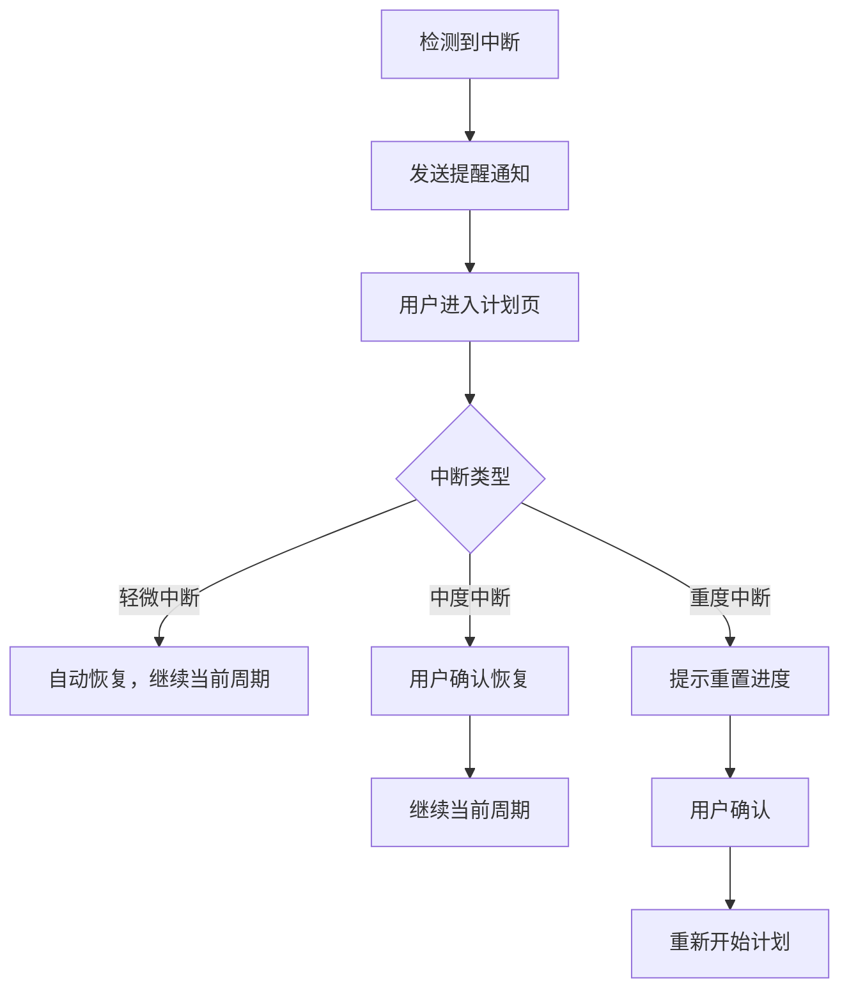
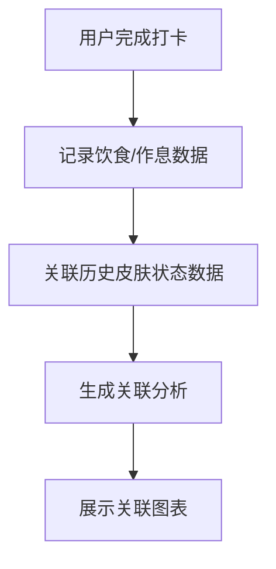
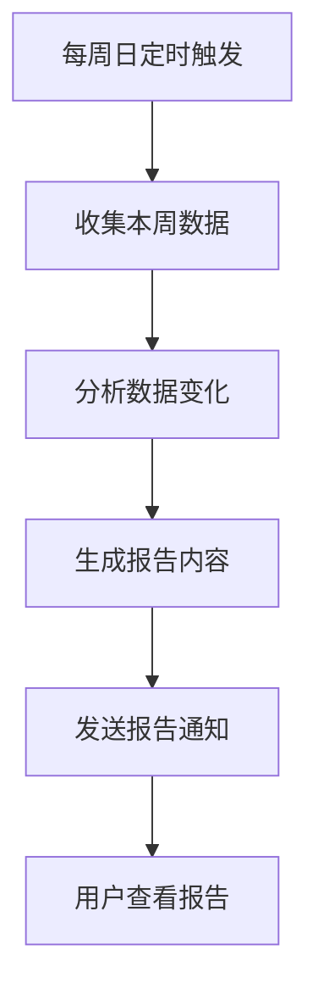
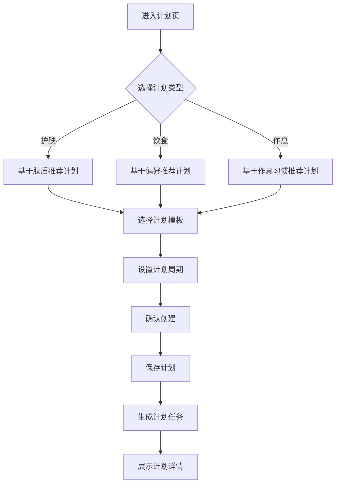
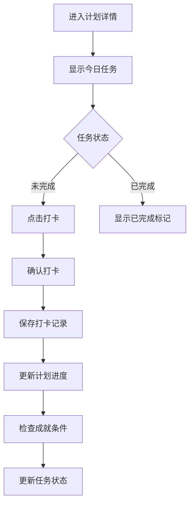

# 模块三：生活美学计划 - 详细设计文档

版本：v5.0（去医疗化合规版）
更新日期：2026年6月17日
所属模块：生活美学计划

---

## 目录

1. [功能概述](#1-功能概述)
2. [业务流程](#2-业务流程)
3. [页面设计](#3-页面设计)
4. [接口设计](#4-接口设计)
5. [数据模型](#5-数据模型)
6. [前端实现](#6-前端实现)
7. [后端实现](#7-后端实现)
8. [异常处理](#8-异常处理)

---

## 合规约束

> **引用文档**：[合规定位与文案规范](../compliance.md)
>
> **合规红线**：
> - 禁止使用"计划"、"健康"等具有医疗暗示的词汇描述饮食建议
> - 禁止使用"治疗"、"治愈"等医疗术语
> - 所有饮食建议需标注"仅供参考，不替代专业医疗建议"
> - 禁止承诺任何健康效果
> - 使用"日常护肤"代替"护肤计划"，使用"饮食建议"代替"健康饮食"

---

## 1. 功能概述

### 1.1 模块定位
生活美学计划模块为用户制定个性化的生活美学计划，包括日常护肤、饮食建议、作息等方面，帮助用户养成良好的生活习惯。

### 1.2 核心功能

| 功能点 | 描述 | 优先级 |
|-------|------|--------|
| 日常护肤 | 根据肤质制定每日护肤流程 | P0 |
| 饮食建议 | 推荐适合的饮食计划 | P1 |
| 作息管理 | 提供作息建议和提醒功能 | P1 |
| 打卡记录 | 用户记录每日计划完成情况 | P0 |
| 进度追踪 | 展示计划执行进度和成果 | P1 |
| 周期解锁机制 | 通过上传验证照解锁下一周期计划 | P0 |
| 中断恢复机制 | 支持计划中断后的恢复执行 | P1 |
| 饮食与状态关联展示 | 展示饮食与皮肤状态的关联分析 | P1 |
| 每周变化报告 | 生成每周计划执行变化报告 | P1 |

### 1.3 功能流程图

```
用户进入计划页 → 选择计划类型 → 创建/选择计划 → 查看每日任务 → 完成打卡 → 上传验证照解锁下一周期 → 查看每周变化报告
```

### 1.4 周期解锁机制

#### 1.4.1 解锁规则

| 周期 | 解锁条件 | 说明 |
|------|---------|------|
| 第1周期 | 创建计划后自动解锁 | 初始周期 |
| 第2周期 | 完成第1周期全部打卡 + 上传验证照 | 验证照需与初始照片相似度≥0.85 |
| 第3周期 | 完成第2周期全部打卡 + 上传验证照 | 同上 |
| 后续周期 | 同上 | 持续解锁机制 |

#### 1.4.2 验证照上传流程



### 1.5 中断恢复机制

#### 1.5.1 中断定义

| 中断类型 | 定义 | 处理方式 |
|---------|------|---------|
| 轻微中断 | 连续2天未打卡 | 自动恢复，继续当前周期 |
| 中度中断 | 连续5天未打卡 | 保留进度，需手动恢复 |
| 重度中断 | 连续14天未打卡 | 重置进度，重新开始 |

#### 1.5.2 恢复流程



### 1.6 饮食与状态关联展示

#### 1.6.1 关联数据

| 数据类型 | 关联维度 | 展示方式 |
|---------|---------|---------|
| 饮食记录 | 与皮肤状态关联 | 图表展示趋势变化 |
| 作息记录 | 与皮肤状态关联 | 热力图展示 |
| 打卡记录 | 与皮肤状态关联 | 折线图展示 |

#### 1.6.2 关联分析规则

> **合规约束**：饮食与状态关联展示仅做并列展示，不做因果推断。所有展示内容需标注"仅供参考，不构成因果关系"。

| 规则 | 说明 |
|------|------|
| 并列展示 | 同时展示饮食记录和皮肤状态变化，不使用"导致"、"引起"等因果词汇 |
| 趋势对比 | 使用趋势图对比变化，标注"相关性不等于因果关系" |
| 避免推断 | 不做任何"XX饮食导致XX皮肤问题"的推断表述 |
| 免责声明 | 关联分析页面必须显示免责声明 |

#### 1.6.3 关联分析流程



### 1.7 每周变化报告

#### 1.7.1 报告内容

| 报告项 | 内容 |
|--------|------|
| 打卡完成率 | 本周打卡完成情况 |
| 皮肤状态变化 | 皮肤状态趋势分析 |
| 饮食建议反馈 | 饮食建议执行情况 |
| 作息规律分析 | 作息规律程度分析 |
| 下周建议 | 个性化的下周建议 |

#### 1.7.2 脱敏版分享规则

| 分享模式 | 可见内容 | 说明 |
|---------|---------|------|
| 完整版 | 全部报告内容 | 分享给闺蜜小组或好友 |
| 脱敏版 | 仅显示百分比数据（如打卡完成率80%） | 分享到公开平台，隐藏个人信息 |

> **脱敏规则**：脱敏版分享仅展示百分比数据，不展示具体照片、姓名、昵称等个人信息。

#### 1.7.3 报告生成流程



---

## 2. 业务流程

### 2.1 计划创建流程



### 2.2 打卡流程



---

## 3. 页面设计

### 3.1 页面清单

| 页面路径 | 页面名称 | 说明 |
|---------|---------|------|
| /plan | 生活美学计划首页 | 展示计划列表和创建入口 |
| /plan/[planId] | 计划详情页 | 查看计划详情和打卡 |

### 3.2 计划首页设计

#### 3.2.1 布局结构

```
┌─────────────────────────────────────────────┐
│              顶部导航栏                      │
├─────────────────────────────────────────────┤
│                                             │
│         ┌──────┐ ┌──────┐ ┌──────┐        │
│         │ 护肤 │ │ 饮食 │ │ 作息 │        │
│         └──────┘ └──────┘ └──────┘        │
│                                             │
│         ┌──────────────┐                   │
│         │   创建计划    │                   │
│         └──────────────┘                   │
│                                             │
│         ┌─────────────────────┐            │
│         │   进行中的计划       │            │
│         │   7天焕肤计划 50%   │            │
│         └─────────────────────┘            │
│                                             │
│         ┌─────────────────────┐            │
│         │   已完成的计划       │            │
│         │   30天作息调整 100%  │            │
│         └─────────────────────┘            │
│                                             │
└─────────────────────────────────────────────┘
```

### 3.3 计划详情页设计

#### 3.3.1 布局结构

```
┌─────────────────────────────────────────────┐
│              顶部导航栏                      │
├─────────────────────────────────────────────┤
│                                             │
│         ┌─────────────────────┐            │
│         │   计划标题           │            │
│         │   7天焕肤计划        │            │
│         │   进度: 50%          │            │
│         └─────────────────────┘            │
│                                             │
│         ┌─────────────────────┐            │
│         │   第3天任务          │            │
│         └─────────────────────┘            │
│                                             │
│         ┌─────────────────────┐            │
│         │   ☑ 早晨洁面         │            │
│         │   ☐ 精华护理         │            │
│         │   ☐ 晚间保湿         │            │
│         └─────────────────────┘            │
│                                             │
│         ┌──────────────┐                   │
│         │   完成打卡    │                   │
│         └──────────────┘                   │
│                                             │
└─────────────────────────────────────────────┘
```

---

## 4. 接口设计

### 4.1 接口清单

| API路径 | 方法 | 说明 | 认证 |
|---------|------|------|------|
| /api/v1/plans | GET | 获取计划列表 | 是 |
| /api/v1/plans | POST | 创建计划 | 是 |
| /api/v1/plans/{id} | GET | 获取计划详情 | 是 |
| /api/v1/plans/checkin | POST | 打卡 | 是 |

### 4.2 创建计划接口

**POST** `/api/v1/plans`

请求体：
```json
{
  "title": "7天焕肤计划",
  "plan_type": 1,
  "description": "一周护肤计划",
  "start_date": "2026-06-17",
  "end_date": "2026-06-23",
  "items": [
    {
      "title": "早晨洁面",
      "description": "使用温和洁面产品",
      "day_index": 1,
      "time_of_day": 1
    }
  ]
}
```

### 4.3 打卡接口

**POST** `/api/v1/plans/checkin`

请求体：
```json
{
  "plan_item_id": "uuid",
  "note": "完成打卡"
}
```

---

## 5. 数据模型

### 5.1 plans 表

| 字段名 | 类型 | 约束 | 说明 |
|-------|------|------|------|
| id | UUID | PRIMARY KEY | 主键 |
| user_id | UUID | FOREIGN KEY | 用户ID |
| title | VARCHAR(100) | NOT NULL | 计划标题 |
| plan_type | SMALLINT | NOT NULL | 计划类型 |
| description | TEXT | | 计划描述 |
| start_date | DATE | NOT NULL | 开始日期 |
| end_date | DATE | NOT NULL | 结束日期 |
| status | SMALLINT | DEFAULT 1 | 状态 |
| created_at | TIMESTAMP | DEFAULT CURRENT_TIMESTAMP | 创建时间 |

### 5.2 plan_items 表

| 字段名 | 类型 | 约束 | 说明 |
|-------|------|------|------|
| id | UUID | PRIMARY KEY | 主键 |
| plan_id | UUID | FOREIGN KEY | 计划ID |
| title | VARCHAR(100) | NOT NULL | 任务标题 |
| description | TEXT | | 任务描述 |
| day_index | INT | NOT NULL | 第几天的任务 |
| time_of_day | SMALLINT | | 执行时间 |

### 5.3 checkins 表

| 字段名 | 类型 | 约束 | 说明 |
|-------|------|------|------|
| id | UUID | PRIMARY KEY | 主键 |
| plan_item_id | UUID | FOREIGN KEY | 计划任务ID |
| user_id | UUID | FOREIGN KEY | 用户ID |
| checkin_date | DATE | NOT NULL | 打卡日期 |
| status | SMALLINT | NOT NULL | 状态 |
| note | TEXT | | 打卡备注 |
| created_at | TIMESTAMP | DEFAULT CURRENT_TIMESTAMP | 创建时间 |

---

## 6. 前端实现

### 6.1 组件结构

```
plan/
├── page.tsx                  # 计划首页
├── [planId]/
│   └── page.tsx              # 计划详情页
└── components/
    ├── PlanCard.tsx          # 计划卡片组件
    ├── PlanProgress.tsx      # 进度条组件
    ├── TaskItem.tsx          # 任务项组件
    └── CheckinButton.tsx     # 打卡按钮组件
```

---

## 7. 后端实现

### 7.1 目录结构

```
modules/plan/
├── plan.module.ts
├── plan.controller.ts
├── plan.service.ts
├── plan.entity.ts
├── plan.dto.ts
└── plan.repository.ts
```

### 7.2 核心逻辑

```typescript
@Injectable()
export class PlanService {
  constructor(
    @InjectRepository(Plan)
    private planRepository: PlanRepository,
    @InjectRepository(PlanItem)
    private planItemRepository: PlanItemRepository,
    @InjectRepository(Checkin)
    private checkinRepository: CheckinRepository
  ) {}

  async checkin(userId: string, planItemId: string, note?: string): Promise<Checkin> {
    const today = new Date().toISOString().split('T')[0];

    const existing = await this.checkinRepository.findOneBy({
      planItemId,
      userId,
      checkinDate: today
    });

    if (existing) {
      throw new BadRequestException('今日已打卡');
    }

    const checkin = this.checkinRepository.create({
      planItemId,
      userId,
      checkinDate: today,
      status: 1,
      note
    });

    await this.checkinRepository.save(checkin);

    await this.updatePlanProgress(planItemId);

    return checkin;
  }
}
```

---

## 8. 异常处理

| 错误码 | 说明 | 处理方式 |
|-------|------|---------|
| 40001 | 计划不存在 | 返回404页面 |
| 40002 | 计划任务不存在 | 返回404页面 |
| 40003 | 今日已打卡 | 提示用户今日已完成 |
| 40004 | 计划已完成 | 提示用户计划已结束 |

---

**文档审批：**
- 产品负责人：___________
- 技术负责人：___________
