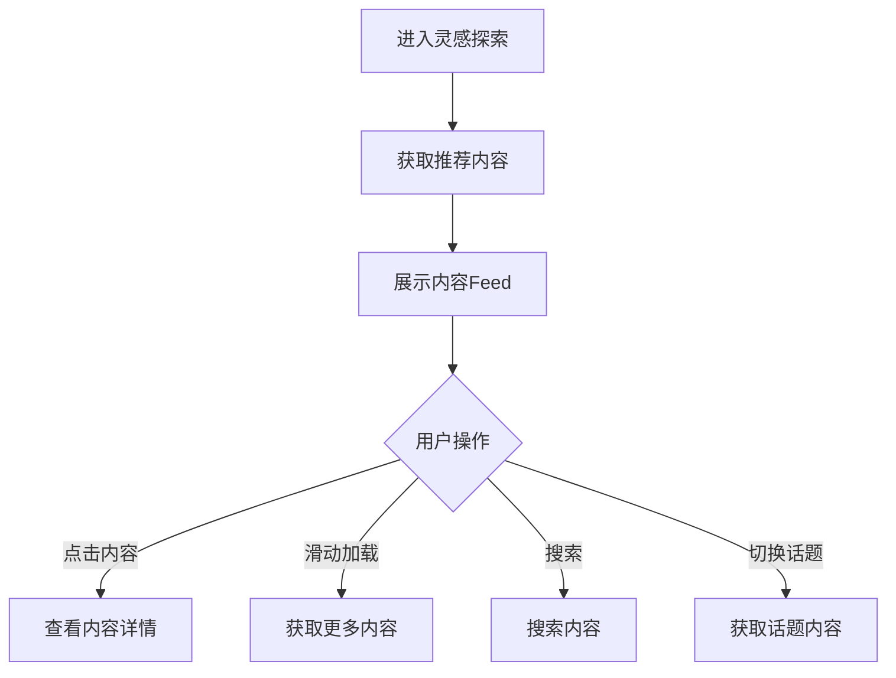
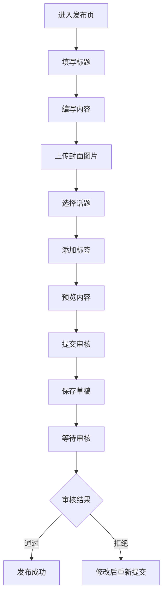

# 模块四：灵感探索 - 详细设计文档

版本：v5.0（去医疗化合规版）  
更新日期：2026年6月17日  
所属模块：灵感探索

---

## 目录

1. [功能概述](#1-功能概述)
2. [业务流程](#2-业务流程)
3. [页面设计](#3-页面设计)
4. [接口设计](#4-接口设计)
5. [数据模型](#5-数据模型)
6. [前端实现](#6-前端实现)
7. [后端实现](#7-后端实现)
8. [异常处理](#8-异常处理)

---

## 1. 功能概述

### 1.1 模块定位
灵感探索模块提供丰富的变美内容，帮助用户发现灵感和潮流趋势，建立积极的社区氛围。

### 1.2 核心功能

| 功能点 | 描述 | 优先级 |
|-------|------|--------|
| 内容Feed流 | 推荐个性化内容流 | P0 |
| 话题分类 | 按话题分类浏览内容 | P1 |
| 搜索功能 | 支持关键词搜索 | P1 |
| 收藏功能 | 用户收藏喜欢的内容 | P0 |
| 内容创作 | 用户发布自己的变美心得 | P1 |

---

## 2. 业务流程

### 2.1 内容浏览流程



### 2.2 内容发布流程



---

## 3. 页面设计

### 3.1 页面清单

| 页面路径 | 页面名称 | 说明 |
|---------|---------|------|
| /explore | 灵感探索首页 | 内容Feed流 |
| /explore/topic/[topicId] | 话题详情页 | 话题下的内容列表 |
| /explore/search | 搜索结果页 | 搜索内容 |
| /explore/publish | 内容发布页 | 发布新内容 |

### 3.2 灵感探索首页设计

```
┌─────────────────────────────────────────────┐
│              顶部导航栏                      │
├─────────────────────────────────────────────┤
│                                             │
│         ┌─────────────────────┐            │
│         │   搜索框             │            │
│         └─────────────────────┘            │
│                                             │
│         ┌──────┐ ┌──────┐ ┌──────┐        │
│         │ 护肤 │ │ 化妆 │ │ 穿搭 │ ...     │
│         └──────┘ └──────┘ └──────┘        │
│                                             │
│         ┌─────────────────────┐            │
│         │   内容卡片1          │            │
│         │   [封面图片]         │            │
│         │   夏日护肤攻略        │            │
│         │   1.2k浏览 200赞    │            │
│         └─────────────────────┘            │
│                                             │
│         ┌─────────────────────┐            │
│         │   内容卡片2          │            │
│         │   [封面图片]         │            │
│         │   日常妆容教程        │            │
│         │   800浏览 150赞     │            │
│         └─────────────────────┘            │
│                                             │
└─────────────────────────────────────────────┘
```

---

## 4. 接口设计

### 4.1 接口清单

| API路径 | 方法 | 说明 | 认证 |
|---------|------|------|------|
| /api/v1/explore/contents | GET | 获取内容列表 | 否 |
| /api/v1/explore/contents/{id} | GET | 获取内容详情 | 否 |
| /api/v1/explore/contents | POST | 发布内容 | 是 |
| /api/v1/explore/topics | GET | 获取话题列表 | 否 |
| /api/v1/explore/search | GET | 搜索内容 | 否 |
| /api/v1/explore/collections | POST | 收藏内容 | 是 |
| /api/v1/explore/collections/{id} | DELETE | 取消收藏 | 是 |

---

## 5. 数据模型

### 5.1 contents 表

| 字段名 | 类型 | 约束 | 说明 |
|-------|------|------|------|
| id | UUID | PRIMARY KEY | 内容ID |
| user_id | UUID | FOREIGN KEY | 发布者ID |
| title | VARCHAR(200) | NOT NULL | 标题 |
| content | TEXT | | 内容正文 |
| cover_image | VARCHAR(500) | | 封面图片 |
| topic_id | UUID | FOREIGN KEY | 话题ID |
| tags | TEXT[] | | 标签数组 |
| views | INT | DEFAULT 0 | 浏览次数 |
| likes | INT | DEFAULT 0 | 点赞次数 |
| shares | INT | DEFAULT 0 | 分享次数 |
| status | SMALLINT | DEFAULT 2 | 状态 |
| is_featured | BOOLEAN | DEFAULT false | 是否精选 |
| created_at | TIMESTAMP | DEFAULT CURRENT_TIMESTAMP | 创建时间 |

### 5.2 topics 表

| 字段名 | 类型 | 约束 | 说明 |
|-------|------|------|------|
| id | UUID | PRIMARY KEY | 话题ID |
| name | VARCHAR(100) | UNIQUE, NOT NULL | 话题名称 |
| description | TEXT | | 话题描述 |
| cover_image | VARCHAR(500) | | 话题封面 |
| content_count | INT | DEFAULT 0 | 内容数量 |
| followers_count | INT | DEFAULT 0 | 关注人数 |
| status | SMALLINT | DEFAULT 1 | 状态 |

### 5.3 collections 表

| 字段名 | 类型 | 约束 | 说明 |
|-------|------|------|------|
| id | UUID | PRIMARY KEY | 收藏ID |
| user_id | UUID | FOREIGN KEY | 用户ID |
| content_id | UUID | FOREIGN KEY | 内容ID |
| created_at | TIMESTAMP | DEFAULT CURRENT_TIMESTAMP | 创建时间 |

---

## 6. 前端实现

### 6.1 组件结构

```
explore/
├── page.tsx                  # 灵感探索首页
├── topic/
│   └── [topicId]/
│       └── page.tsx          # 话题详情页
├── search/
│   └── page.tsx              # 搜索结果页
├── publish/
│   └── page.tsx              # 内容发布页
└── components/
    ├── ContentCard.tsx       # 内容卡片组件
    ├── SearchBar.tsx         # 搜索栏组件
    ├── TopicTag.tsx          # 话题标签组件
    └── ContentDetail.tsx     # 内容详情组件
```

---

## 7. 后端实现

### 7.1 目录结构

```
modules/explore/
├── explore.module.ts
├── explore.controller.ts
├── explore.service.ts
├── explore.entity.ts
├── explore.dto.ts
└── explore.repository.ts
```

### 7.2 核心逻辑

```typescript
@Injectable()
export class ExploreService {
  constructor(
    @InjectRepository(Content)
    private contentRepository: ContentRepository,
    @InjectRepository(Topic)
    private topicRepository: TopicRepository
  ) {}

  async getContents(topicId?: string, tag?: string): Promise<Content[]> {
    const queryBuilder = this.contentRepository.createQueryBuilder('content')
      .where('content.status = :status', { status: ContentStatus.PUBLISHED })
      .orderBy('content.created_at', 'DESC');

    if (topicId) {
      queryBuilder.andWhere('content.topic_id = :topicId', { topicId });
    }

    if (tag) {
      queryBuilder.andWhere(':tag = ANY(content.tags)', { tag });
    }

    return queryBuilder.getMany();
  }
}
```

---

## 8. 异常处理

| 错误码 | 说明 | 处理方式 |
|-------|------|---------|
| 30001 | 内容不存在 | 返回404页面 |
| 30002 | 内容审核中 | 提示用户等待审核 |
| 30003 | 内容已删除 | 返回404页面 |
| 30004 | 话题不存在 | 返回404页面 |

---

**文档审批：**
- 产品负责人：___________
- 技术负责人：___________