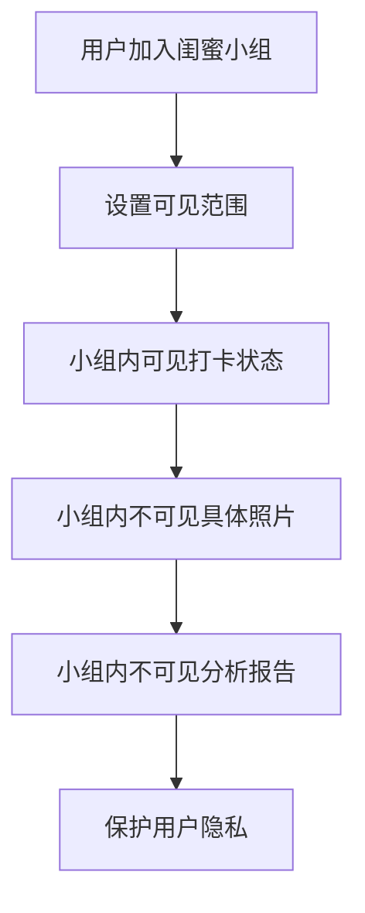
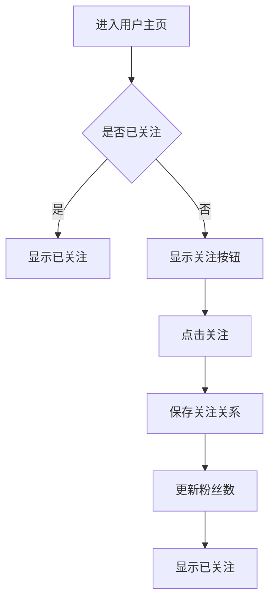
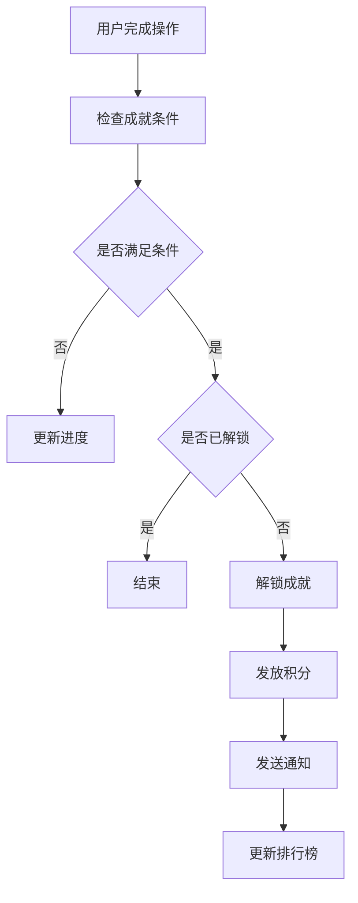

# 模块五：成就与社交 - 详细设计文档

版本：v5.0（去医疗化合规版）
更新日期：2026年6月17日
所属模块：成就与社交

---

## 目录

1. [功能概述](#1-功能概述)
2. [业务流程](#2-业务流程)
3. [页面设计](#3-页面设计)
4. [接口设计](#4-接口设计)
5. [数据模型](#5-数据模型)
6. [前端实现](#6-前端实现)
7. [后端实现](#7-后端实现)
8. [异常处理](#8-异常处理)

---

## 合规约束

> **引用文档**：[合规定位与文案规范](../compliance.md)
>
> **合规红线**：
> - 禁止设置全局公开排行榜，仅允许小组内排名
> - 闺蜜小组不可展示成员具体照片
> - 闺蜜小组不提供聊天功能
> - 禁止使用"最美丽"、"第一名"等绝对化排名词汇
> - 成就徽章描述需积极正向，避免比较性词汇

---

## 1. 功能概述

### 1.1 模块定位
成就与社交模块建立成就系统和社交互动机制，增强用户粘性和参与感。

### 1.2 核心功能

| 功能点 | 描述 | 优先级 |
|-------|------|--------|
| 成就徽章 | 完成特定任务获得成就徽章 | P1 |
| 积分系统 | 参与活动获得积分 | P1 |
| 小组内排名 | 闺蜜小组内部的成就排名 | P2 |
| 关注/粉丝 | 用户之间互相关注 | P0 |
| 评论互动 | 用户对内容进行评论互动 | P0 |
| 12枚勋章详细列表 | 完整的勋章体系和发放逻辑 | P0 |
| 闺蜜小组隐私边界 | 小组成员不可见具体照片 | P0 |
| 闺蜜小组无聊天功能 | 小组专注于打卡和分享，不提供即时聊天 | P0 |

### 1.3 12枚勋章详细列表

| 勋章名称 | 图标 | 获得条件 | 积分奖励 | 发放逻辑 |
|---------|------|---------|---------|---------|
| 初次分析 | ✨ | 完成第一次面部分析 | 50 | 自动发放 |
| 坚持不懈 | 📅 | 连续打卡7天 | 100 | 自动发放 |
| 风格探索者 | 🎨 | 完成风格测试 | 30 | 自动发放 |
| 分享达人 | 📤 | 成功分享5次 | 80 | 自动发放 |
| 邀请好友 | 👭 | 邀请1位好友注册 | 100 | 延时24小时发放 |
| 计划完成者 | 🏆 | 完成一个完整计划 | 150 | 自动发放 |
| 照片验证 | 📷 | 上传验证照通过 | 50 | 自动发放 |
| 连续分析 | 🔄 | 每月完成4次分析 | 200 | 每月结算 |
| 闺蜜组长 | 👑 | 创建闺蜜小组 | 100 | 自动发放 |
| 小组活跃 | 💬 | 小组内互动10次 | 80 | 自动发放 |
| AI顾问用户 | 🤖 | 与AI顾问对话3次 | 50 | 自动发放 |
| 会员升级 | ⭐ | 升级为白银会员 | 300 | 自动发放 |

### 1.4 闺蜜小组隐私边界

#### 1.4.1 可见内容

| 内容类型 | 是否可见 | 说明 |
|---------|---------|------|
| 打卡状态 | 可见 | 显示打卡完成情况 |
| 成就进度 | 可见 | 显示成就解锁进度 |
| 积分数量 | 可见 | 显示积分总数 |
| 分析次数 | 可见 | 显示分析次数 |
| 具体照片 | 不可见 | 保护用户隐私 |
| 详细分析报告 | 不可见 | 保护用户隐私 |

#### 1.4.2 互动方式

| 互动类型 | 是否支持 | 说明 |
|---------|---------|------|
| 点赞 | 支持 | 对小组动态点赞 |
| 评论 | 支持 | 对小组动态评论 |
| 分享 | 支持 | 分享小组动态 |
| 聊天 | 不支持 | 不提供即时聊天功能 |
| 私信 | 不支持 | 不提供私信功能 |

#### 1.4.3 隐私保护机制



---

## 2. 业务流程

### 2.1 关注流程



### 2.2 成就解锁流程



---

## 3. 页面设计

### 3.1 页面清单

| 页面路径 | 页面名称 | 说明 |
|---------|---------|------|
| /social | 社交首页 | 展示关注动态 |
| /social/achievements | 成就中心 | 查看成就列表 |
| /social/leaderboard | 排行榜 | 查看排名 |

### 3.2 成就中心设计

```
┌─────────────────────────────────────────────┐
│              顶部导航栏                      │
├─────────────────────────────────────────────┤
│                                             │
│         ┌─────────────────────┐            │
│         │   总积分: 1200      │            │
│         │   成就数: 8/20      │            │
│         └─────────────────────┘            │
│                                             │
│         ┌──────┐ ┌──────┐ ┌──────┐        │
│         │ 分析 │ │ 计划 │ │ 社交 │        │
│         └──────┘ └──────┘ └──────┘        │
│                                             │
│         ┌─────────────────────┐            │
│         │   ★ 初次分析        │            │
│         │   [图标]            │            │
│         │   完成第一次分析     │            │
│         └─────────────────────┘            │
│                                             │
│         ┌─────────────────────┐            │
│         │   ○ 坚持打卡        │            │
│         │   [灰色图标]        │            │
│         │   连续打卡7天(3/7)   │            │
│         └─────────────────────┘            │
│                                             │
└─────────────────────────────────────────────┘
```

---

## 4. 接口设计

### 4.1 接口清单

| API路径 | 方法 | 说明 | 认证 |
|---------|------|------|------|
| /api/v1/social/follow | POST | 关注用户 | 是 |
| /api/v1/social/follow/{id} | DELETE | 取消关注 | 是 |
| /api/v1/social/following | GET | 获取关注列表 | 是 |
| /api/v1/social/followers | GET | 获取粉丝列表 | 是 |
| /api/v1/social/comments | GET | 获取评论列表 | 否 |
| /api/v1/social/comments | POST | 发布评论 | 是 |
| /api/v1/social/achievements | GET | 获取成就列表 | 是 |
| /api/v1/social/leaderboard | GET | 获取排行榜 | 否 |

---

## 5. 数据模型

### 5.1 followers 表

| 字段名 | 类型 | 约束 | 说明 |
|-------|------|------|------|
| id | UUID | PRIMARY KEY | 主键 |
| follower_id | UUID | FOREIGN KEY | 关注者ID |
| followee_id | UUID | FOREIGN KEY | 被关注者ID |
| created_at | TIMESTAMP | DEFAULT CURRENT_TIMESTAMP | 创建时间 |

### 5.2 comments 表

| 字段名 | 类型 | 约束 | 说明 |
|-------|------|------|------|
| id | UUID | PRIMARY KEY | 评论ID |
| user_id | UUID | FOREIGN KEY | 用户ID |
| content_id | UUID | FOREIGN KEY | 内容ID |
| parent_id | UUID | FOREIGN KEY | 父评论ID |
| content | TEXT | NOT NULL | 评论内容 |
| likes | INT | DEFAULT 0 | 点赞数 |
| status | SMALLINT | DEFAULT 1 | 状态 |
| created_at | TIMESTAMP | DEFAULT CURRENT_TIMESTAMP | 创建时间 |

### 5.3 achievements 表

| 字段名 | 类型 | 约束 | 说明 |
|-------|------|------|------|
| id | UUID | PRIMARY KEY | 成就ID |
| name | VARCHAR(50) | UNIQUE, NOT NULL | 成就名称 |
| description | TEXT | | 成就描述 |
| icon | VARCHAR(255) | | 成就图标 |
| points | INT | DEFAULT 0 | 成就积分 |
| achievement_type | SMALLINT | NOT NULL | 成就类型 |
| condition | JSONB | NOT NULL | 达成条件 |
| created_at | TIMESTAMP | DEFAULT CURRENT_TIMESTAMP | 创建时间 |

### 5.4 user_achievements 表

| 字段名 | 类型 | 约束 | 说明 |
|-------|------|------|------|
| id | UUID | PRIMARY KEY | 主键 |
| user_id | UUID | FOREIGN KEY | 用户ID |
| achievement_id | UUID | FOREIGN KEY | 成就ID |
| unlocked_at | TIMESTAMP | | 解锁时间 |
| progress | INT | DEFAULT 0 | 进度 |

---

## 6. 前端实现

### 6.1 组件结构

```
social/
├── page.tsx                  # 社交首页
├── achievements/
│   └── page.tsx              # 成就中心
├── leaderboard/
│   └── page.tsx              # 排行榜
└── components/
    ├── AchievementBadge.tsx  # 成就徽章组件
    ├── FollowButton.tsx      # 关注按钮组件
    ├── CommentList.tsx       # 评论列表组件
    └── LeaderboardItem.tsx   # 排行榜项组件
```

---

## 7. 后端实现

### 7.1 目录结构

```
modules/social/
├── social.module.ts
├── social.controller.ts
├── social.service.ts
├── social.entity.ts
├── social.dto.ts
└── social.repository.ts
```

### 7.2 核心逻辑

```typescript
@Injectable()
export class SocialService {
  constructor(
    @InjectRepository(Follower)
    private followerRepository: FollowerRepository,
    @InjectRepository(Achievement)
    private achievementRepository: AchievementRepository,
    @InjectRepository(UserAchievement)
    private userAchievementRepository: UserAchievementRepository
  ) {}

  async checkAchievements(userId: string, action: AchievementAction) {
    const achievements = await this.achievementRepository.find({
      where: { achievementType: action.type }
    });

    for (const achievement of achievements) {
      const userAchievement = await this.userAchievementRepository.findOneBy({
        userId,
        achievementId: achievement.id
      });

      if (!userAchievement || userAchievement.progress < 100) {
        const newProgress = this.calculateProgress(achievement, action);

        if (newProgress >= 100) {
          await this.unlockAchievement(userId, achievement.id);
        } else if (userAchievement) {
          userAchievement.progress = newProgress;
          await this.userAchievementRepository.save(userAchievement);
        }
      }
    }
  }
}
```

---

## 8. 异常处理

| 错误码 | 说明 | 处理方式 |
|-------|------|---------|
| 50001 | 评论不存在 | 返回404页面 |
| 50002 | 成就不存在 | 返回404页面 |
| 50003 | 成就未解锁 | 提示用户未解锁 |
| 50004 | 已关注该用户 | 提示用户已关注 |
| 50005 | 未关注该用户 | 提示用户未关注 |

---

**文档审批：**
- 产品负责人：___________
- 技术负责人：___________
