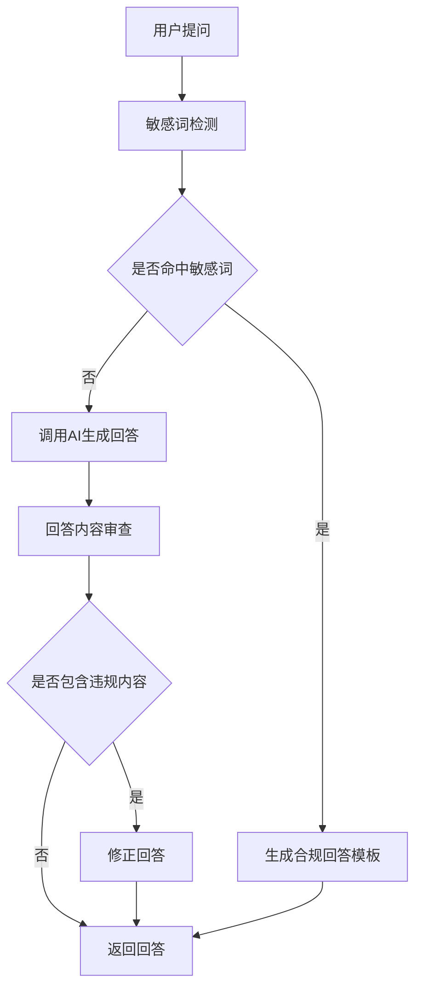
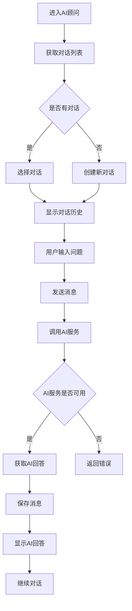

# 模块六：AI变美顾问 - 详细设计文档

版本：v5.0（去医疗化合规版）
更新日期：2026年6月17日
所属模块：AI变美顾问

---

## 目录

1. [功能概述](#1-功能概述)
2. [业务流程](#2-业务流程)
3. [页面设计](#3-页面设计)
4. [接口设计](#4-接口设计)
5. [数据模型](#5-数据模型)
6. [前端实现](#6-前端实现)
7. [后端实现](#7-后端实现)
8. [异常处理](#8-异常处理)
9. [合规定制](#9-合规定制)

---

## 合规约束

> **引用文档**：[合规定位与文案规范](../compliance.md)
>
> **合规红线**：
> - AI顾问禁止提供医疗诊断服务
> - AI顾问禁止推荐药品或医美项目
> - AI顾问禁止承诺任何治疗效果
> - AI回答需经过安全护栏过滤
> - 所有AI回答需标注"仅供参考，不能替代专业医疗建议"

---

## 1. 功能概述

### 1.1 模块定位
AI变美顾问模块提供AI智能问答服务，解答用户变美相关问题，提供个性化推荐。

### 1.2 核心功能

| 功能点 | 描述 | 优先级 |
|-------|------|--------|
| 智能问答 | 用户提问，AI给出专业回答 | P0 |
| 个性化推荐 | 根据用户情况提供定制建议 | P0 |
| 对话历史 | 保存对话记录，支持查看 | P1 |
| 多轮对话 | 支持多轮对话，深入解答 | P0 |
| AI顾问安全护栏规则 | 过滤医疗相关内容，确保回答合规 | P0 |
| AI顾问次数限制 | 免费用户每天最多3次对话 | P0 |

### 1.3 AI顾问安全护栏规则

#### 1.3.1 敏感词过滤

| 类别 | 敏感词 | 处理方式 |
|------|-------|---------|
| 医疗诊断 | 诊断、确诊、患有、疾病、病症 | 拒绝回答，引导就医 |
| 治疗建议 | 治疗、治愈、根治、疗效、药方 | 拒绝回答，引导就医 |
| 药品推荐 | 药、药品、药物、药膏、处方 | 拒绝回答，引导就医 |
| 医美项目 | 整形、手术、注射、填充、吸脂 | 拒绝回答，引导就医 |
| 疗效承诺 | 保证、一定、100%、立刻见效 | 过滤承诺词汇 |

#### 1.3.2 回答安全审查流程



#### 1.3.3 合规回答模板

| 场景 | 回答模板 |
|------|---------|
| 医疗问题 | "根据你的描述，建议咨询专业医生获取专业意见。本平台提供的内容仅供参考，不能替代专业医疗建议。" |
| 药品推荐 | "关于产品选择，建议根据自身情况进行选择，如有过敏或不适请立即停止使用并就医。" |
| 医美项目 | "关于整形美容相关的内容，建议咨询专业机构和医生。本平台不提供相关建议。" |

#### 1.3.4 尾部就医引导

> **所有AI回答必须包含尾部就医引导**，确保用户在需要时能寻求专业医疗帮助。

| 引导类型 | 内容 | 触发条件 |
|---------|------|---------|
| 皮肤问题引导 | "如果您的皮肤问题持续或加重，建议咨询专业皮肤科医生。" | 涉及皮肤问题的回答 |
| 健康问题引导 | "本平台提供的内容仅供参考，不能替代专业医疗建议。如有健康问题，请及时就医。" | 所有回答 |
| 医疗咨询引导 | "关于医疗相关问题，建议咨询专业医生获取专业意见。" | 用户询问医疗相关问题 |

> **安全护栏5条规则总结**：
> 1. 禁止医疗诊断（诊断、确诊、患有、疾病、病症）
> 2. 禁止治疗建议（治疗、治愈、根治、疗效、药方）
> 3. 禁止药品推荐（药、药品、药物、药膏、处方）
> 4. 禁止医美项目推荐（整形、手术、注射、填充、吸脂）
> 5. 禁止疗效承诺（保证、一定、100%、立刻见效）

### 1.4 AI顾问次数限制

#### 1.4.1 次数规则

| 用户类型 | 每日次数 | 说明 |
|---------|---------|------|
| 免费用户 | 3次 | 基础免费次数 |
| 白银会员 | 10次 | 会员特权 |
| 黄金会员 | 20次 | 高级会员特权 |
| 铂金会员 | 无限 | 顶级会员特权 |

#### 1.4.2 次数刷新规则

| 规则 | 说明 |
|------|------|
| 刷新时间 | 每天00:00自动刷新 |
| 次数累积 | 未使用次数不累积 |
| 超额处理 | 超出次数后提示升级会员或明日再试 |

#### 1.4.3 提示文案

| 场景 | 提示文案 |
|------|---------|
| 剩余1次 | "您今天还剩1次AI顾问机会" |
| 次数用完 | "您今天的AI顾问机会已用完，升级会员可获得更多机会" |
| 会员升级 | "恭喜升级！您现在每天可使用XX次AI顾问" |

---

## 2. 业务流程

### 2.1 对话流程



---

## 3. 页面设计

### 3.1 页面清单

| 页面路径 | 页面名称 | 说明 |
|---------|---------|------|
| /consultant | AI顾问首页 | 对话列表和聊天界面 |

### 3.2 AI顾问页面设计

```
┌─────────────────────────────────────────────┐
│              顶部导航栏                      │
├─────────────────────────────────────────────┤
│                                             │
│         ┌─────────────────────┐            │
│         │   对话列表           │            │
│         │   • 护肤咨询         │            │
│         │   • 妆容推荐         │            │
│         │   • + 新对话          │            │
│         └─────────────────────┘            │
│                                             │
│         ┌─────────────────────┐            │
│         │   聊天区域           │            │
│         │                     │            │
│         │   用户: 我的皮肤干   │            │
│         │                     │            │
│         │   AI: 建议使用...     │            │
│         │                     │            │
│         └─────────────────────┘            │
│                                             │
│         ┌─────────────────────┐            │
│         │   [输入框]           │            │
│         │   [发送按钮]         │            │
│         └─────────────────────┘            │
│                                             │
└─────────────────────────────────────────────┘
```

---

## 4. 接口设计

### 4.1 接口清单

| API路径 | 方法 | 说明 | 认证 |
|---------|------|------|------|
| /api/v1/consultant/conversations | GET | 获取对话列表 | 是 |
| /api/v1/consultant/conversations | POST | 创建对话 | 是 |
| /api/v1/consultant/conversations/{id} | GET | 获取对话详情 | 是 |
| /api/v1/consultant/conversations/{id}/messages | POST | 发送消息 | 是 |

### 4.2 发送消息接口

**POST** `/api/v1/consultant/conversations/{id}/messages`

请求体：
```json
{
  "content": "我的皮肤比较干，应该用什么护肤品？"
}
```

成功响应：
```json
{
  "code": 200,
  "message": "success",
  "data": {
    "user_message": {
      "id": "uuid",
      "role": "user",
      "content": "我的皮肤比较干，应该用什么护肤品？",
      "created_at": "2026-06-17T10:00:00Z"
    },
    "assistant_message": {
      "id": "uuid",
      "role": "assistant",
      "content": "干性皮肤建议使用保湿效果好的护肤品...",
      "created_at": "2026-06-17T10:00:30Z"
    }
  },
  "timestamp": 1700000000000
}
```

---

## 5. 数据模型

### 5.1 conversations 表

| 字段名 | 类型 | 约束 | 说明 |
|-------|------|------|------|
| id | UUID | PRIMARY KEY | 对话ID |
| user_id | UUID | FOREIGN KEY | 用户ID |
| title | VARCHAR(100) | | 对话标题 |
| status | SMALLINT | DEFAULT 1 | 状态 |
| created_at | TIMESTAMP | DEFAULT CURRENT_TIMESTAMP | 创建时间 |
| updated_at | TIMESTAMP | DEFAULT CURRENT_TIMESTAMP | 更新时间 |

### 5.2 messages 表

| 字段名 | 类型 | 约束 | 说明 |
|-------|------|------|------|
| id | UUID | PRIMARY KEY | 消息ID |
| conversation_id | UUID | FOREIGN KEY | 对话ID |
| user_id | UUID | FOREIGN KEY | 用户ID |
| role | VARCHAR(20) | NOT NULL | 角色（user/assistant） |
| content | TEXT | NOT NULL | 消息内容 |
| created_at | TIMESTAMP | DEFAULT CURRENT_TIMESTAMP | 创建时间 |

---

## 6. 前端实现

### 6.1 组件结构

```
consultant/
├── page.tsx                  # AI顾问首页
└── components/
    ├── ChatSidebar.tsx       # 对话列表组件
    ├── ChatArea.tsx          # 聊天区域组件
    ├── ChatMessage.tsx       # 消息组件
    └── ChatInput.tsx         # 输入框组件
```

### 6.2 关键代码示例

```typescript
const sendMessage = async (content: string) => {
  setLoading(true);
  try {
    const response = await axios.post(
      `/api/v1/consultant/conversations/${conversationId}/messages`,
      { content }
    );
    addMessage(response.data.data.user_message);
    addMessage(response.data.data.assistant_message);
  } catch (error) {
    showError('AI服务暂不可用，请稍后重试');
  } finally {
    setLoading(false);
  }
};
```

---

## 7. 后端实现

### 7.1 目录结构

```
modules/consultant/
├── consultant.module.ts
├── consultant.controller.ts
├── consultant.service.ts
├── consultant.entity.ts
├── consultant.dto.ts
└── consultant.repository.ts
```

### 7.2 核心逻辑

```typescript
@Injectable()
export class ConsultantService {
  constructor(
    @InjectRepository(Conversation)
    private conversationRepository: ConversationRepository,
    @InjectRepository(Message)
    private messageRepository: MessageRepository,
    private aiProvider: AiProvider
  ) {}

  async sendMessage(conversationId: string, userId: string, content: string): Promise<{ userMessage: Message; assistantMessage: Message }> {
    const userMessage = this.messageRepository.create({
      conversationId,
      userId,
      role: 'user',
      content
    });
    await this.messageRepository.save(userMessage);

    const userData = await this.getUserData(userId);

    const aiResponse = await this.aiProvider.chat({
      messages: await this.getConversationHistory(conversationId),
      userData
    });

    const assistantMessage = this.messageRepository.create({
      conversationId,
      userId,
      role: 'assistant',
      content: aiResponse
    });
    await this.messageRepository.save(assistantMessage);

    return { userMessage, assistantMessage };
  }
}
```

---

## 8. 异常处理

| 错误码 | 说明 | 处理方式 |
|-------|------|---------|
| 60001 | 对话不存在 | 返回404页面 |
| 60002 | 消息不存在 | 返回404页面 |
| 60003 | AI服务暂不可用 | 提示用户稍后重试 |

---

## 9. 合规定制

### 9.1 合规声明

在AI顾问页面必须显示以下合规声明：

> "AI顾问回答仅供参考，不能替代专业医疗建议。如有皮肤问题，请咨询专业皮肤科医生。"

### 9.2 禁止内容

| 禁止内容 | 说明 |
|---------|------|
| 医疗诊断 | AI禁止提供医疗诊断服务 |
| 药品推荐 | AI禁止推荐药品 |
| 医美推荐 | AI禁止推荐医美项目 |
| 疗效承诺 | AI禁止承诺治疗效果 |

### 9.3 回答规范

| 场景 | 规范 |
|------|------|
| 皮肤问题 | 建议咨询专业医生 |
| 医疗问题 | 拒绝回答，引导就医 |
| 药品问题 | 拒绝推荐，引导就医 |

---

**文档审批：**
- 产品负责人：___________
- 技术负责人：___________
