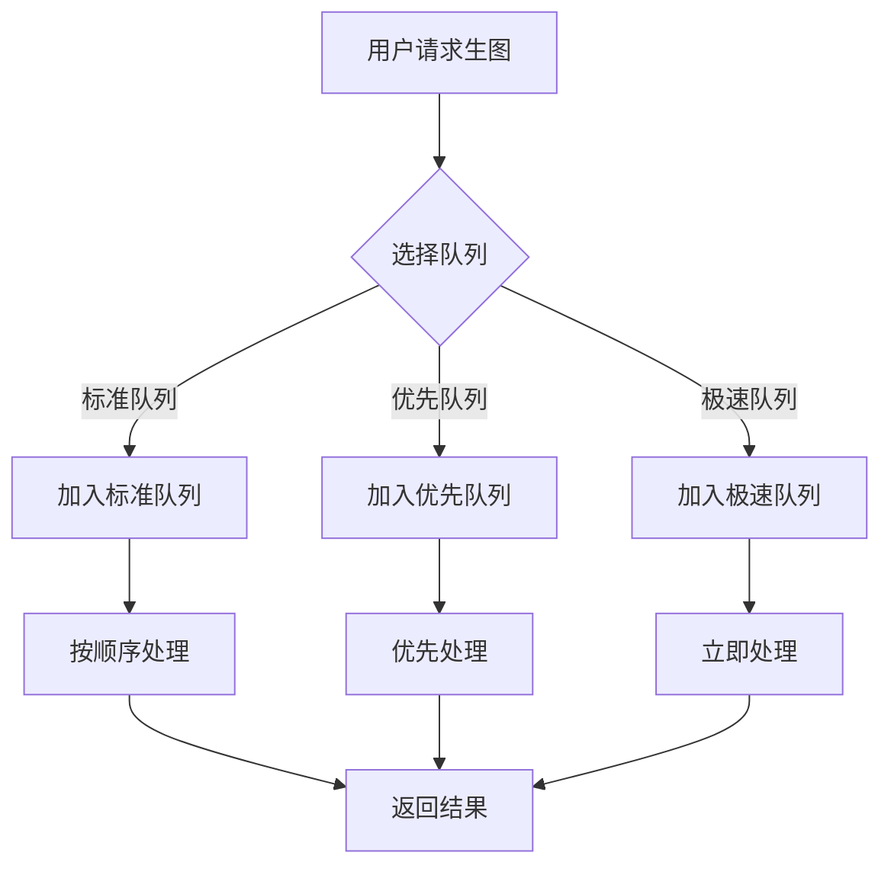
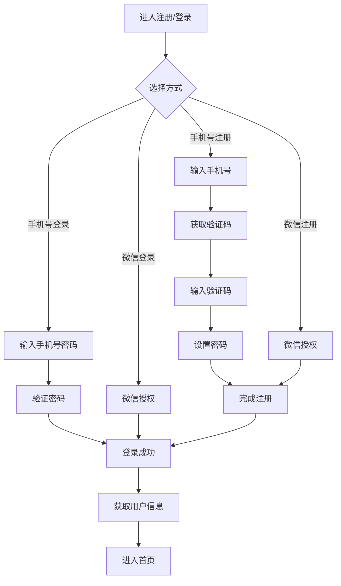
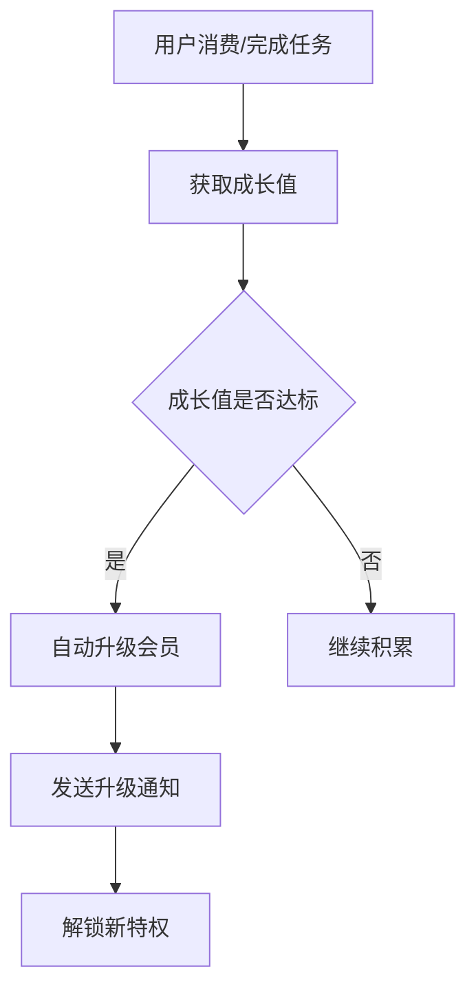

# 模块七：用户与会员系统 - 详细设计文档

版本：v5.0（去医疗化合规版）
更新日期：2026年6月17日
所属模块：用户与会员系统

---

## 目录

1. [功能概述](#1-功能概述)
2. [业务流程](#2-业务流程)
3. [页面设计](#3-页面设计)
4. [接口设计](#4-接口设计)
5. [数据模型](#5-数据模型)
6. [前端实现](#6-前端实现)
7. [后端实现](#7-后端实现)
8. [异常处理](#8-异常处理)
9. [合规定制](#9-合规定制)

---

## 合规约束

> **引用文档**：[合规定位与文案规范](../compliance.md)
>
> **合规红线**：
> - 用户注册必须同意隐私政策
> - 数据收集仅收集必要信息，明确告知用途
> - 用户数据需加密存储
> - 支持用户注销账号并删除数据
> - 积分规则需清晰说明，不得虚假承诺
> - 会员特权不得包含医疗服务承诺

---

## 1. 功能概述

### 1.1 模块定位
用户与会员系统是平台的核心基础设施，负责用户身份认证、会员体系管理、积分和成长值系统。

### 1.2 核心功能

| 功能点 | 描述 | 优先级 |
|-------|------|--------|
| 用户注册 | 手机号/微信注册 | P0 |
| 用户登录 | 多方式登录 | P0 |
| 个人资料 | 编辑个人信息 | P0 |
| 会员体系 | 会员等级和特权 | P0 |
| 积分系统 | 积分获取和使用 | P1 |
| 成长值 | 用户成长体系 | P1 |
| 优惠券 | 优惠券管理 | P1 |
| 消息通知 | 系统消息推送 | P1 |
| 积分获取/消耗完整规则 | 详细的积分获取和消耗规则 | P0 |
| 积分有效期 | 免费积分90天有效期 | P0 |
| 生图队列设计 | 标准/优先/极速三种队列 | P0 |

### 1.3 积分获取/消耗完整规则

#### 1.3.1 积分获取规则

| 获取方式 | 积分数量 | 限制条件 | 说明 |
|---------|---------|---------|------|
| 注册奖励 | 100 | 一次性 | 新用户注册即送 |
| 每日签到 | 10 | 每天1次 | 连续签到额外奖励 |
| 完成分析 | 50 | 每次分析 | 完成面部分析或肤质检测 |
| 完成打卡 | 5 | 每次打卡 | 完成生活美学计划打卡 |
| 邀请好友 | 100 | 延时24小时发放 | 好友完成注册 |
| 分享内容 | 20 | 每天5次 | 分享分析报告或造型推荐 |
| 完成计划 | 150 | 每个计划 | 完成一个完整的生活美学计划 |
| 会员升级 | 300 | 每次升级 | 升级为更高等级会员 |
| 成就解锁 | 30-300 | 取决于成就 | 解锁成就徽章获得积分 |

#### 1.3.2 积分消耗规则

| 消耗方式 | 积分数量 | 说明 |
|---------|---------|------|
| 生成效果图 | 50 | 使用AI生成造型效果图 |
| 极速生图 | 100 | 使用极速队列生成效果图 |
| 兑换优惠券 | 200-500 | 根据优惠券面额 |
| 兑换会员天数 | 500 | 兑换7天会员体验 |

#### 1.3.3 积分计算示例

| 场景 | 计算方式 | 结果 |
|------|---------|------|
| 新用户注册 | 100 | +100 |
| 第1天完成分析+打卡 | 50+5 | +55 |
| 连续7天签到 | 10×7 + 20(连续奖励) | +90 |

### 1.4 积分有效期

#### 1.4.1 有效期规则

| 积分类型 | 有效期 | 说明 |
|---------|--------|------|
| 免费获取积分 | 90天 | 从获取之日起算 |
| 充值购买积分 | 永久有效 | 无有效期限制 |
| 活动奖励积分 | 30天 | 从获取之日起算 |

#### 1.4.2 过期处理

| 规则 | 说明 |
|------|------|
| 过期提醒 | 积分过期前7天发送提醒通知 |
| 过期扣减 | 过期积分自动扣减 |
| 扣减记录 | 记录过期扣减日志 |
| 优先消耗 | 优先消耗即将过期的积分 |

#### 1.4.3 积分展示

| 展示项 | 说明 |
|--------|------|
| 总积分 | 当前可用积分总数 |
| 即将过期 | 30天内即将过期的积分 |
| 积分明细 | 最近30天的积分变动记录 |

### 1.5 个人数据管理

#### 1.5.1 用户数据下载

| 数据类型 | 说明 | 是否可下载 |
|---------|------|-----------|
| 个人资料 | 用户注册时填写的信息 | 是 |
| 分析记录 | 面部分析和肤质检测记录 | 是 |
| 分析结果 | 分析报告详细内容 | 是 |
| 效果图 | AI生成的造型效果图 | 是 |
| 打卡记录 | 生活美学计划打卡记录 | 是 |
| 成就记录 | 成就解锁记录 | 是 |
| 对话记录 | 与AI顾问的对话记录 | 是 |

#### 1.5.2 用户注销流程

| 步骤 | 说明 | 时间 |
|------|------|------|
| 第1步 | 用户提交注销申请 | 即时 |
| 第2步 | 进入7天冷静期 | 7天内可撤销 |
| 第3步 | 冷静期结束后标记为待删除 | 第7天 |
| 第4步 | 延迟30天物理删除 | 第37天 |
| 第5步 | 发送注销完成通知 | 第37天 |

> **删除规则**：
> - 7天冷静期内用户可随时撤销注销申请
> - 冷静期后数据标记为待删除，用户无法恢复
> - 30天后执行物理删除，删除所有用户数据（包括照片、分析结果等）
> - 删除后账号无法恢复，可使用同一手机号重新注册

#### 1.5.3 注销数据清理范围

| 数据类型 | 是否删除 | 说明 |
|---------|---------|------|
| 用户基本信息 | 是 | 姓名、手机号、邮箱等 |
| 分析记录和结果 | 是 | 所有分析相关数据 |
| 效果图 | 是 | AI生成的造型效果图 |
| 打卡记录 | 是 | 生活美学计划打卡记录 |
| 成就记录 | 是 | 成就解锁记录 |
| 对话记录 | 是 | AI顾问对话记录 |
| 分享记录 | 是 | 分享链接和海报记录 |
| 推荐关系 | 是 | 邀请好友关系记录 |
| 积分记录 | 是 | 积分获取和消耗记录 |

### 1.6 生图队列设计

#### 1.6.1 队列类型

| 队列类型 | 优先级 | 处理时间 | 积分消耗 | 适用场景 |
|---------|--------|---------|---------|---------|
| 标准队列 | 普通 | 30-60秒 | 50积分 | 日常使用 |
| 优先队列 | 高 | 15-30秒 | 80积分 | 会员特权 |
| 极速队列 | 最高 | 5-10秒 | 100积分 | 紧急使用 |

#### 1.6.2 队列优先级

| 用户类型 | 默认队列 | 可使用队列 |
|---------|---------|---------|
| 免费用户 | 标准队列 | 标准队列 |
| 白银会员 | 优先队列 | 标准/优先队列 |
| 黄金会员 | 优先队列 | 标准/优先/极速队列 |
| 铂金会员 | 极速队列 | 所有队列 |

#### 1.6.3 队列处理流程



---

## 2. 业务流程

### 2.1 注册登录流程



### 2.2 会员升级流程



---

## 3. 页面设计

### 3.1 页面清单

| 页面路径 | 页面名称 | 说明 |
|---------|---------|------|
| /auth/login | 登录页面 | 用户登录 |
| /auth/register | 注册页面 | 用户注册 |
| /profile | 个人主页 | 个人信息展示 |
| /profile/edit | 编辑资料 | 编辑个人信息 |
| /membership | 会员中心 | 会员特权和等级 |
| /wallet | 钱包中心 | 积分、优惠券管理 |
| /notifications | 消息中心 | 系统消息 |

### 3.2 会员中心页面设计

```
┌─────────────────────────────────────────────┐
│              顶部导航栏                      │
├─────────────────────────────────────────────┤
│                                             │
│         ┌──────────────────────────┐        │
│         │    用户头像 + 昵称        │        │
│         │    会员等级：白银会员      │        │
│         │    成长值：1250/2000      │        │
│         │    积分：500              │        │
│         └──────────────────────────┘        │
│                                             │
│         ┌──────────────────────────┐        │
│         │   会员特权                │        │
│         │   • 专属优惠券            │        │
│         │   • 优先客服              │        │
│         │   • 会员专属内容           │        │
│         └──────────────────────────┘        │
│                                             │
│         ┌──────────────────────────┐        │
│         │   升级进度                │        │
│         │   [████████░░░░░░░░░░]   │        │
│         │   再获得750成长值升级      │        │
│         └──────────────────────────┘        │
│                                             │
└─────────────────────────────────────────────┘
```

---

## 4. 接口设计

### 4.1 接口清单

| API路径 | 方法 | 说明 | 认证 |
|---------|------|------|------|
| /api/v1/auth/register | POST | 用户注册 | 否 |
| /api/v1/auth/login | POST | 用户登录 | 否 |
| /api/v1/auth/logout | POST | 用户登出 | 是 |
| /api/v1/users/profile | GET | 获取用户信息 | 是 |
| /api/v1/users/profile | PUT | 更新用户信息 | 是 |
| /api/v1/membership/info | GET | 获取会员信息 | 是 |
| /api/v1/wallet/points | GET | 获取积分余额 | 是 |
| /api/v1/wallet/coupons | GET | 获取优惠券列表 | 是 |
| /api/v1/notifications | GET | 获取消息列表 | 是 |

### 4.2 用户注册接口

**POST** `/api/v1/auth/register`

请求体：
```json
{
  "phone": "13800138000",
  "code": "123456",
  "password": "password123",
  "nickname": "爱美小仙女"
}
```

成功响应：
```json
{
  "code": 200,
  "message": "success",
  "data": {
    "token": "eyJhbGciOiJIUzI1NiIsInR5cCI6IkpXVCJ9...",
    "user": {
      "id": "uuid",
      "nickname": "爱美小仙女",
      "phone": "138****8000",
      "avatar": null,
      "member_level": "bronze",
      "points": 0,
      "growth_value": 0
    }
  },
  "timestamp": 1700000000000
}
```

### 4.3 获取会员信息接口

**GET** `/api/v1/membership/info`

成功响应：
```json
{
  "code": 200,
  "message": "success",
  "data": {
    "level": "silver",
    "level_name": "白银会员",
    "growth_value": 1250,
    "next_level_growth_value": 2000,
    "privileges": [
      "专属优惠券",
      "优先客服",
      "会员专属内容"
    ],
    "expire_date": null
  },
  "timestamp": 1700000000000
}
```

---

## 5. 数据模型

### 5.1 users 表

| 字段名 | 类型 | 约束 | 说明 |
|-------|------|------|------|
| id | UUID | PRIMARY KEY | 用户ID |
| phone | VARCHAR(20) | UNIQUE | 手机号 |
| password | VARCHAR(255) | | 密码（加密存储） |
| nickname | VARCHAR(50) | NOT NULL | 昵称 |
| avatar | VARCHAR(500) | | 头像URL |
| gender | SMALLINT | | 性别 |
| birthday | DATE | | 生日 |
| skin_type | SMALLINT | | 肤质 |
| member_level | VARCHAR(20) | DEFAULT 'bronze' | 会员等级 |
| points | INT | DEFAULT 0 | 积分 |
| growth_value | INT | DEFAULT 0 | 成长值 |
| status | SMALLINT | DEFAULT 1 | 状态 |
| created_at | TIMESTAMP | DEFAULT CURRENT_TIMESTAMP | 创建时间 |
| updated_at | TIMESTAMP | DEFAULT CURRENT_TIMESTAMP | 更新时间 |

### 5.2 coupons 表

| 字段名 | 类型 | 约束 | 说明 |
|-------|------|------|------|
| id | UUID | PRIMARY KEY | 优惠券ID |
| user_id | UUID | FOREIGN KEY | 用户ID |
| type | SMALLINT | NOT NULL | 类型 |
| value | DECIMAL(10,2) | NOT NULL | 金额/折扣 |
| min_amount | DECIMAL(10,2) | | 最低消费 |
| expire_date | TIMESTAMP | NOT NULL | 过期时间 |
| status | SMALLINT | DEFAULT 1 | 状态 |
| created_at | TIMESTAMP | DEFAULT CURRENT_TIMESTAMP | 创建时间 |

### 5.3 notifications 表

| 字段名 | 类型 | 约束 | 说明 |
|-------|------|------|------|
| id | UUID | PRIMARY KEY | 消息ID |
| user_id | UUID | FOREIGN KEY | 用户ID |
| type | SMALLINT | NOT NULL | 类型 |
| title | VARCHAR(100) | NOT NULL | 标题 |
| content | TEXT | NOT NULL | 内容 |
| read_status | SMALLINT | DEFAULT 0 | 阅读状态 |
| created_at | TIMESTAMP | DEFAULT CURRENT_TIMESTAMP | 创建时间 |

### 5.4 member_levels 表（配置表）

| 字段名 | 类型 | 约束 | 说明 |
|-------|------|------|------|
| level | VARCHAR(20) | PRIMARY KEY | 等级标识 |
| name | VARCHAR(50) | NOT NULL | 等级名称 |
| min_growth | INT | NOT NULL | 最低成长值 |
| privileges | JSON | | 特权列表 |

---

## 6. 前端实现

### 6.1 组件结构

```
auth/
├── login/page.tsx             # 登录页面
└── register/page.tsx          # 注册页面

profile/
├── page.tsx                  # 个人主页
├── edit/page.tsx             # 编辑资料
└── components/
    ├── ProfileHeader.tsx     # 个人信息头部
    ├── ProfileStats.tsx      # 统计信息

membership/
├── page.tsx                  # 会员中心
└── components/
    ├── MemberCard.tsx        # 会员卡组件
    ├── PrivilegeList.tsx     # 特权列表

wallet/
├── page.tsx                  # 钱包中心
└── components/
    ├── PointsCard.tsx        # 积分卡片
    ├── CouponList.tsx        # 优惠券列表

notifications/
└── page.tsx                  # 消息中心
```

### 6.2 关键代码示例

```typescript
const handleRegister = async (formData: RegisterForm) => {
  setLoading(true);
  try {
    const response = await axios.post('/api/v1/auth/register', formData);
    localStorage.setItem('token', response.data.data.token);
    router.push('/');
  } catch (error) {
    showError('注册失败，请重试');
  } finally {
    setLoading(false);
  }
};

const getMemberLevelName = (level: string): string => {
  const levels: Record<string, string> = {
    bronze: '青铜会员',
    silver: '白银会员',
    gold: '黄金会员',
    platinum: '铂金会员'
  };
  return levels[level] || '普通会员';
};
```

---

## 7. 后端实现

### 7.1 目录结构

```
modules/auth/
├── auth.module.ts
├── auth.controller.ts
├── auth.service.ts
├── auth.dto.ts
└── jwt.strategy.ts

modules/users/
├── users.module.ts
├── users.controller.ts
├── users.service.ts
├── users.entity.ts
└── users.dto.ts

modules/membership/
├── membership.module.ts
├── membership.controller.ts
├── membership.service.ts
└── membership.entity.ts

modules/wallet/
├── wallet.module.ts
├── wallet.controller.ts
├── wallet.service.ts
└── wallet.entity.ts
```

### 7.2 核心逻辑

```typescript
@Injectable()
export class AuthService {
  constructor(
    @InjectRepository(User)
    private userRepository: UserRepository,
    private jwtService: JwtService,
    private passwordEncoder: PasswordEncoder
  ) {}

  async register(dto: RegisterDto): Promise<{ token: string; user: User }> {
    const existingUser = await this.userRepository.findOne({ where: { phone: dto.phone } });
    if (existingUser) {
      throw new ConflictException('该手机号已注册');
    }

    const user = this.userRepository.create({
      phone: dto.phone,
      password: this.passwordEncoder.encode(dto.password),
      nickname: dto.nickname
    });
    await this.userRepository.save(user);

    const token = this.jwtService.sign({ userId: user.id });
    return { token, user };
  }

  async login(dto: LoginDto): Promise<{ token: string; user: User }> {
    const user = await this.userRepository.findOne({ where: { phone: dto.phone } });
    if (!user || !this.passwordEncoder.matches(dto.password, user.password)) {
      throw new UnauthorizedException('手机号或密码错误');
    }

    const token = this.jwtService.sign({ userId: user.id });
    return { token, user };
  }
}
```

---

## 8. 异常处理

| 错误码 | 说明 | 处理方式 |
|-------|------|---------|
| 70001 | 手机号已注册 | 提示用户更换手机号 |
| 70002 | 手机号或密码错误 | 提示用户重新输入 |
| 70003 | 用户不存在 | 提示用户注册 |
| 70004 | 验证码错误 | 提示用户重新获取 |
| 70005 | 会员等级不存在 | 返回默认等级 |

---

## 9. 合规定制

### 9.1 隐私合规

| 场景 | 规范 |
|------|------|
| 用户注册 | 必须同意隐私政策才能注册 |
| 数据收集 | 仅收集必要信息，明确告知用途 |
| 数据存储 | 用户数据加密存储 |
| 数据删除 | 支持用户注销账号并删除数据 |

### 9.2 会员体系合规

| 场景 | 规范 |
|------|------|
| 会员权益 | 明确说明会员特权范围 |
| 积分规则 | 清晰说明积分获取和使用规则 |
| 优惠券 | 明确使用条件和有效期 |
| 自动续费 | 若涉及需明确告知用户 |

### 9.3 禁止内容

| 禁止内容 | 说明 |
|---------|------|
| 医疗承诺 | 会员特权不得包含医疗服务承诺 |
| 虚假宣传 | 不得虚假宣传会员权益 |
| 强制消费 | 不得强制用户购买会员 |

---

**文档审批：**
- 产品负责人：___________
- 技术负责人：___________
