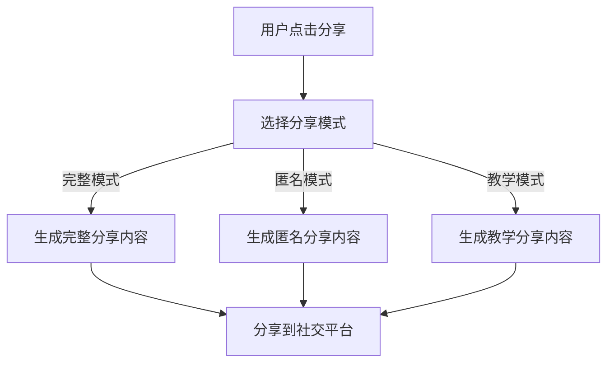
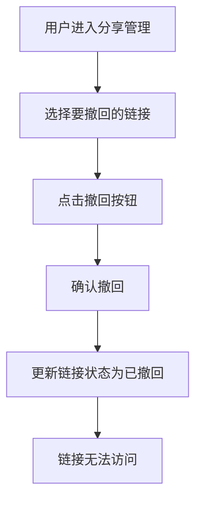
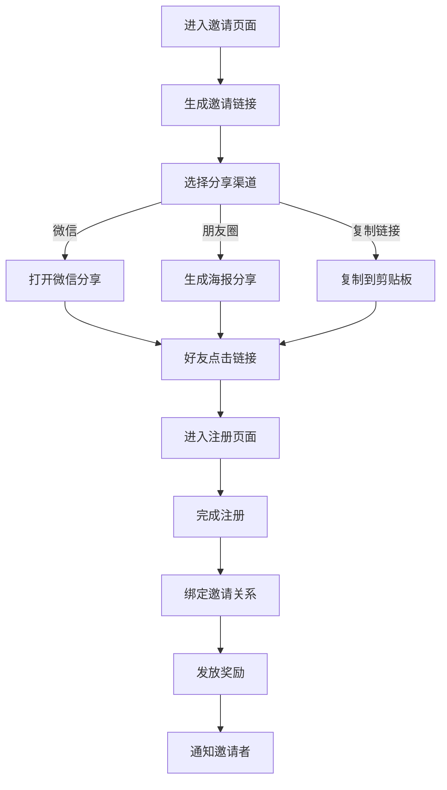
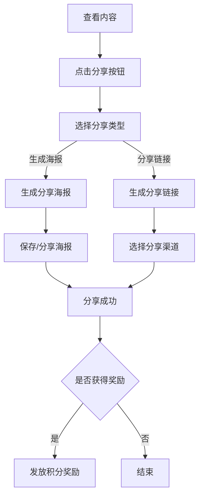

# 模块八：分享系统 - 详细设计文档

版本：v5.0（去医疗化合规版）
更新日期：2026年6月17日
所属模块：分享系统

---

## 目录

1. [功能概述](#1-功能概述)
2. [业务流程](#2-业务流程)
3. [页面设计](#3-页面设计)
4. [接口设计](#4-接口设计)
5. [数据模型](#5-数据模型)
6. [前端实现](#6-前端实现)
7. [后端实现](#7-后端实现)
8. [异常处理](#8-异常处理)
9. [合规定制](#9-合规定制)

---

## 合规约束

> **引用文档**：[合规定位与文案规范](../compliance.md)
>
> **合规红线**：
> - 分享内容不得包含医疗承诺、疗效宣传
> - 分享图片不得使用医疗相关图片
> - 分享标题不得夸大效果
> - 邀请奖励规则需明确说明，不得虚假宣传
> - 分享链接需设置有效期和撤回机制

---

## 1. 功能概述

### 1.1 模块定位
分享系统是平台的社交传播引擎，支持用户分享内容到第三方社交平台，邀请好友注册获得奖励，以及生成个性化分享海报。

### 1.2 核心功能

| 功能点 | 描述 | 优先级 |
|-------|------|--------|
| 内容分享 | 分享变美日记、分析报告到社交平台 | P0 |
| 邀请好友 | 生成邀请链接，邀请好友注册 | P0 |
| 分享海报 | 生成个性化分享海报 | P0 |
| 分享奖励 | 分享和邀请获得积分奖励 | P1 |
| 分享统计 | 查看分享效果统计 | P1 |
| 分享三种模式 | 完整模式/匿名模式/教学模式 | P0 |
| 分享链接有效期 | 24小时有效期 | P0 |
| 分享链接撤回 | 支持用户撤回分享链接 | P1 |

### 1.3 分享三种模式

#### 1.3.1 模式定义

| 模式 | 说明 | 可见内容 | 适用场景 |
|------|------|---------|---------|
| 完整模式 | 分享完整内容 | 所有分析结果、推荐内容、用户信息 | 分享给好友或社交媒体 |
| 匿名模式 | 分享匿名内容 | 分析结果、推荐内容，隐藏用户身份信息 | 分享到公开平台 |
| 教学模式 | 分享教学内容 | 仅展示知识科普、技巧教程 | 分享教学类内容 |

#### 1.3.2 模式切换

| 操作 | 说明 |
|------|------|
| 选择分享 | 用户选择分享内容时选择分享模式 |
| 模式预览 | 选择模式后可预览分享效果 |
| 默认模式 | 默认使用完整模式 |

#### 1.3.3 模式对比



### 1.4 分享链接有效期

#### 1.4.1 有效期规则

| 链接类型 | 有效期 | 说明 |
|---------|--------|------|
| 内容分享链接 | 24小时 | 从生成之日起算 |
| 邀请链接 | 7天 | 从生成之日起算 |
| 海报分享链接 | 24小时 | 从生成之日起算 |

#### 1.4.2 过期处理

| 规则 | 说明 |
|------|------|
| 过期提示 | 链接过期后显示友好提示页面 |
| 重新生成 | 用户可重新生成分享链接 |
| 过期记录 | 记录过期链接访问日志 |

#### 1.4.3 有效期展示

| 展示项 | 说明 |
|--------|------|
| 剩余时间 | 分享链接页面显示剩余有效期 |
| 过期提醒 | 过期前1小时发送提醒通知 |
| 链接状态 | 管理页面显示链接状态（有效/已过期） |

### 1.5 分享链接撤回

#### 1.5.1 撤回规则

| 规则 | 说明 |
|------|------|
| 撤回权限 | 只有链接生成者可以撤回 |
| 撤回时间 | 链接有效期内均可撤回 |
| 撤回效果 | 撤回后链接无法访问 |
| 撤回记录 | 记录撤回操作日志 |

#### 1.5.2 撤回流程



#### 1.5.3 撤回提示

| 场景 | 提示文案 |
|------|---------|
| 撤回成功 | "分享链接已撤回" |
| 链接已过期 | "链接已过期，无需撤回" |
| 链接已被访问 | "链接已被访问，仍可撤回" |

---

## 2. 业务流程

### 2.1 邀请好友流程



### 2.2 内容分享流程



---

## 3. 页面设计

### 3.1 页面清单

| 页面路径 | 页面名称 | 说明 |
|---------|---------|------|
| /share/invite | 邀请好友 | 邀请链接和奖励规则 |
| /share/poster | 分享海报 | 生成个性化海报 |
| /share/stats | 分享统计 | 分享效果数据 |

### 3.2 邀请好友页面设计

```
┌─────────────────────────────────────────────┐
│              顶部导航栏                      │
├─────────────────────────────────────────────┤
│                                             │
│         ┌──────────────────────────┐        │
│         │    邀请好友               │        │
│         │    每邀请1位好友得100积分   │        │
│         └──────────────────────────┘        │
│                                             │
│         ┌──────────────────────────┐        │
│         │    我的邀请码             │        │
│         │    ABC123                │        │
│         │    [复制邀请码]           │        │
│         └──────────────────────────┘        │
│                                             │
│         ┌──────────────────────────┐        │
│         │    邀请链接              │        │
│         │    https://xxx/share/... │        │
│         │    [复制链接]             │        │
│         └──────────────────────────┘        │
│                                             │
│         ┌──────────┐  ┌──────────┐         │
│         │  微信好友  │  │  朋友圈   │         │
│         └──────────┘  └──────────┘         │
│                                             │
│         ┌──────────────────────────┐        │
│         │    邀请记录               │        │
│         │    • 小美 已注册          │        │
│         │    • 小丽 已注册          │        │
│         └──────────────────────────┘        │
│                                             │
└─────────────────────────────────────────────┘
```

---

## 4. 接口设计

### 4.1 接口清单

| API路径 | 方法 | 说明 | 认证 |
|---------|------|------|------|
| /api/v1/share/invite-link | GET | 获取邀请链接 | 是 |
| /api/v1/share/poster | POST | 生成分享海报 | 是 |
| /api/v1/share/stats | GET | 获取分享统计 | 是 |
| /api/v1/share/records | GET | 获取分享记录 | 是 |
| /api/v1/share/reward | POST | 发放分享奖励 | 是 |

### 4.2 获取邀请链接接口

**GET** `/api/v1/share/invite-link`

成功响应：
```json
{
  "code": 200,
  "message": "success",
  "data": {
    "invite_code": "ABC123",
    "invite_link": "https://beauty-share.com/invite/ABC123",
    "invite_count": 5,
    "reward_points": 500,
    "rules": "每邀请1位好友注册可得100积分"
  },
  "timestamp": 1700000000000
}
```

### 4.3 生成分享海报接口

**POST** `/api/v1/share/poster`

请求体：
```json
{
  "type": "analysis",
  "content_id": "uuid",
  "template": "default"
}
```

成功响应：
```json
{
  "code": 200,
  "message": "success",
  "data": {
    "poster_url": "https://storage.beauty-share.com/posters/xxx.png",
    "share_link": "https://beauty-share.com/share/xxx"
  },
  "timestamp": 1700000000000
}
```

---

## 5. 数据模型

### 5.1 share_records 表

| 字段名 | 类型 | 约束 | 说明 |
|-------|------|------|------|
| id | UUID | PRIMARY KEY | 分享记录ID |
| user_id | UUID | FOREIGN KEY | 用户ID |
| type | SMALLINT | NOT NULL | 分享类型 |
| content_id | UUID | | 分享内容ID |
| channel | SMALLINT | | 分享渠道 |
| poster_url | VARCHAR(500) | | 海报URL |
| share_link | VARCHAR(500) | | 分享链接 |
| click_count | INT | DEFAULT 0 | 点击次数 |
| convert_count | INT | DEFAULT 0 | 转化次数 |
| reward_status | SMALLINT | DEFAULT 0 | 奖励状态 |
| created_at | TIMESTAMP | DEFAULT CURRENT_TIMESTAMP | 创建时间 |

### 5.2 invite_records 表

| 字段名 | 类型 | 约束 | 说明 |
|-------|------|------|------|
| id | UUID | PRIMARY KEY | 邀请记录ID |
| inviter_id | UUID | FOREIGN KEY | 邀请者ID |
| invitee_id | UUID | FOREIGN KEY | 被邀请者ID |
| invite_code | VARCHAR(20) | | 邀请码 |
| status | SMALLINT | DEFAULT 0 | 状态 |
| reward_points | INT | DEFAULT 0 | 奖励积分 |
| created_at | TIMESTAMP | DEFAULT CURRENT_TIMESTAMP | 创建时间 |

### 5.3 share_templates 表（配置表）

| 字段名 | 类型 | 约束 | 说明 |
|-------|------|------|------|
| id | UUID | PRIMARY KEY | 模板ID |
| name | VARCHAR(50) | NOT NULL | 模板名称 |
| type | SMALLINT | NOT NULL | 适用类型 |
| config | JSON | | 模板配置 |
| status | SMALLINT | DEFAULT 1 | 状态 |

---

## 6. 前端实现

### 6.1 组件结构

```
share/
├── invite/page.tsx          # 邀请好友页面
├── poster/page.tsx          # 海报生成页面
├── stats/page.tsx           # 分享统计页面
└── components/
    ├── ShareButton.tsx      # 分享按钮组件
    ├── PosterGenerator.tsx  # 海报生成组件
    ├── InviteCard.tsx       # 邀请卡片组件
    └── ShareStats.tsx       # 分享统计组件
```

### 6.2 关键代码示例

```typescript
const handleShare = async (contentId: string, type: string) => {
  try {
    const response = await axios.post('/api/v1/share/poster', {
      type,
      content_id: contentId,
      template: 'default'
    });

    const { poster_url, share_link } = response.data.data;

    if (navigator.share) {
      await navigator.share({
        title: '我的变美日记',
        text: '快来看看我的变美分析报告',
        url: share_link
      });
    } else {
      showPosterModal(poster_url);
    }

    await axios.post('/api/v1/share/reward', {
      content_id: contentId,
      type
    });
  } catch (error) {
    showError('分享失败，请重试');
  }
};

const generateInviteLink = async () => {
  const response = await axios.get('/api/v1/share/invite-link');
  setInviteData(response.data.data);
};
```

---

## 7. 后端实现

### 7.1 目录结构

```
modules/share/
├── share.module.ts
├── share.controller.ts
├── share.service.ts
├── share.entity.ts
├── share.dto.ts
└── share.repository.ts
```

### 7.2 核心逻辑

```typescript
@Injectable()
export class ShareService {
  constructor(
    @InjectRepository(ShareRecord)
    private shareRecordRepository: ShareRecordRepository,
    @InjectRepository(InviteRecord)
    private inviteRecordRepository: InviteRecordRepository,
    private posterGenerator: PosterGenerator,
    private userService: UserService
  ) {}

  async generateInviteLink(userId: string): Promise<InviteLinkDto> {
    const user = await this.userService.getUser(userId);
    const inviteCode = user.invite_code || this.generateInviteCode();

    if (!user.invite_code) {
      user.invite_code = inviteCode;
      await this.userService.updateUser(userId, { invite_code: inviteCode });
    }

    const inviteCount = await this.inviteRecordRepository.count({
      where: { inviter_id: userId, status: 1 }
    });

    return {
      invite_code: inviteCode,
      invite_link: `${process.env.FRONTEND_URL}/invite/${inviteCode}`,
      invite_count: inviteCount,
      reward_points: inviteCount * 100,
      rules: '每邀请1位好友注册可得100积分'
    };
  }

  async generatePoster(dto: GeneratePosterDto): Promise<PosterResultDto> {
    const posterUrl = await this.posterGenerator.generate(dto);
    const shareLink = `${process.env.FRONTEND_URL}/share/${dto.content_id}`;

    await this.shareRecordRepository.save({
      user_id: dto.userId,
      type: dto.type,
      content_id: dto.content_id,
      poster_url: posterUrl,
      share_link: shareLink
    });

    return { poster_url: posterUrl, share_link };
  }

  private generateInviteCode(): string {
    const chars = 'ABCDEFGHIJKLMNOPQRSTUVWXYZ0123456789';
    let code = '';
    for (let i = 0; i < 6; i++) {
      code += chars.charAt(Math.floor(Math.random() * chars.length));
    }
    return code;
  }
}
```

---

## 8. 异常处理

| 错误码 | 说明 | 处理方式 |
|-------|------|---------|
| 80001 | 分享内容不存在 | 返回404错误 |
| 80002 | 海报生成失败 | 提示用户重试 |
| 80003 | 邀请码生成失败 | 提示用户重试 |
| 80004 | 奖励发放失败 | 记录日志，后台补发 |
| 80005 | 分享过于频繁 | 提示用户稍后再试 |

---

## 9. 合规定制

### 9.1 分享内容合规

| 场景 | 规范 |
|------|------|
| 分享文案 | 不得包含医疗承诺、疗效宣传 |
| 分享图片 | 不得使用医疗相关图片 |
| 分享标题 | 不得夸大效果 |

### 9.2 邀请奖励合规

| 场景 | 规范 |
|------|------|
| 奖励规则 | 明确说明奖励条件和发放时间 |
| 邀请限制 | 设置合理的邀请奖励上限 |
| 反作弊 | 防止刷邀请行为 |

### 9.3 禁止内容

| 禁止内容 | 说明 |
|---------|------|
| 医疗宣传 | 分享内容不得涉及医疗宣传 |
| 虚假奖励 | 不得虚假宣传邀请奖励 |
| 诱导分享 | 不得强制或诱导用户分享 |

---

**文档审批：**
- 产品负责人：___________
- 技术负责人：___________
