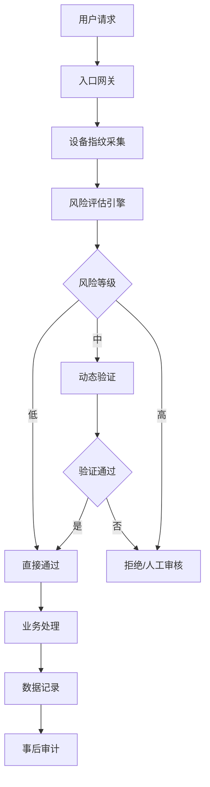
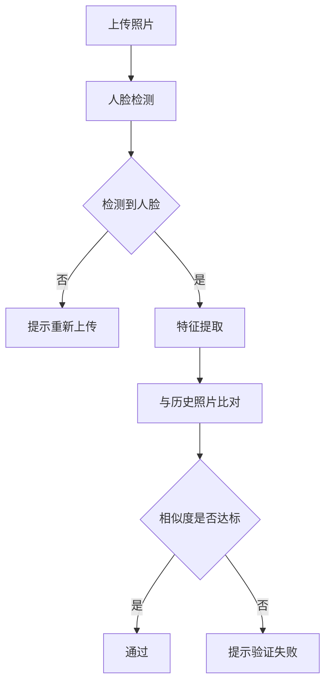
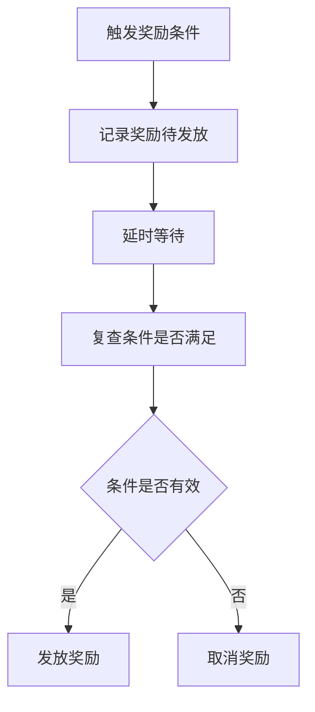

# 模块九：风控系统 - 详细设计文档

版本：v5.0（去医疗化合规版）  
更新日期：2026年6月17日  
所属模块：风控系统

---

## 目录

1. [功能概述](#1-功能概述)
2. [风控体系架构](#2-风控体系架构)
3. [多层防御体系](#3-多层防御体系)
4. [事后审计机制](#4-事后审计机制)
5. [接口设计](#5-接口设计)
6. [数据模型](#6-数据模型)
7. [前端实现](#7-前端实现)
8. [后端实现](#8-后端实现)
9. [异常处理](#9-异常处理)
10. [合规定制](#10-合规定制)

---

## 1. 功能概述

### 1.1 模块定位
风控系统是平台的安全基础设施，独立于用户系统，负责识别和防范各类风险行为，保障平台安全稳定运行和用户数据安全。

### 1.2 核心功能

| 功能点 | 描述 | 优先级 |
|-------|------|--------|
| 设备指纹 | 识别用户设备唯一性，防范设备伪造 | P0 |
| 手机号验证 | 验证手机号真实性，防范批量注册 | P0 |
| 照片相似度检测 | 检测上传照片相似度，防范照片伪造 | P0 |
| 行为真实度评分 | 评估用户行为真实性，识别异常行为 | P0 |
| 动态验证 | 根据风险等级触发不同验证方式 | P0 |
| 支付验证 | 保障支付安全，防范支付欺诈 | P1 |
| 延时发放 | 敏感操作后延时发放奖励，降低损失 | P1 |
| 事后审计 | 定期审计风险事件，优化风控策略 | P1 |

### 1.3 功能流程图

```
用户操作 → 设备指纹采集 → 风险评估 → {风险等级判断}
                                    ↓
                          低风险 → 直接通过
                          中风险 → 触发动态验证
                          高风险 → 拒绝操作/人工审核
```

---

## 2. 风控体系架构

### 2.1 整体架构



### 2.2 核心组件

| 组件 | 职责 |
|------|------|
| 设备指纹服务 | 采集和识别设备唯一标识 |
| 风险评估引擎 | 根据多维度数据评估风险等级 |
| 验证服务 | 提供短信、滑块、图片等验证方式 |
| 规则引擎 | 管理风控规则和策略 |
| 审计服务 | 定期审计风险事件 |

---

## 3. 多层防御体系

### 3.1 第一层：设备指纹

#### 3.1.1 采集维度

| 维度 | 采集内容 | 说明 |
|------|---------|------|
| 设备信息 | 设备型号、操作系统、浏览器信息 | 识别设备类型 |
| 网络信息 | IP地址、网络类型、运营商 | 识别网络环境 |
| 行为特征 | 操作频率、时间间隔、点击位置 | 识别行为模式 |
| 硬件标识 | 设备ID、MAC地址（加密存储） | 识别设备唯一性 |

#### 3.1.2 指纹生成算法

```
设备指纹 = SHA256(设备型号 + 操作系统 + 浏览器版本 + IP地址 + 时间戳 + 随机盐)
```

#### 3.1.3 风险判断

| 场景 | 判断条件 | 风险等级 |
|------|---------|---------|
| 新设备首次登录 | 设备指纹从未出现过 | 低 |
| 同一设备多账号 | 同一指纹关联多个账号 | 中 |
| 频繁切换设备 | 短时间内更换多个设备 | 高 |

---

### 3.2 第二层：手机号验证

#### 3.2.1 验证方式

| 方式 | 说明 | 适用场景 |
|------|------|---------|
| 短信验证码 | 用户填写收到的验证码 | 注册、登录 |
| 语音验证码 | 自动语音播报验证码 | 短信无法接收时 |
| 三要素验证 | 姓名+身份证+手机号 | 敏感操作 |

#### 3.2.2 风控规则

| 规则 | 限制条件 | 触发动作 |
|------|---------|---------|
| 发送频率 | 同一手机号1分钟内最多发送1次 | 限制发送 |
| 每日上限 | 同一手机号每日最多发送5次 | 暂停服务 |
| 批量检测 | 同一IP/设备短时间发送多个号码 | 封禁IP/设备 |

---

### 3.3 第三层：照片相似度检测

#### 3.3.1 检测场景

| 场景 | 说明 |
|------|------|
| 分析照片上传 | 检测是否为本人照片 |
| 效果图生成 | 检测上传照片与历史照片一致性 |
| 验证照上传 | 检测是否为本人近期照片 |

#### 3.3.2 相似度算法

| 算法 | 说明 | 阈值 |
|------|------|------|
| SSIM | 结构相似性指数 | ≥0.85通过 |
| 人脸特征比对 | 提取人脸特征向量比对 | 余弦相似度≥0.9 |
| pHash | 感知哈希算法，计算汉明距离 | 汉明距离<5通过 |

#### 3.3.3 pHash检测规则

| 参数 | 值 | 说明 |
|------|------|------|
| 哈希算法 | pHash | 感知哈希算法 |
| 汉明距离阈值 | <5 | 汉明距离小于5视为同一照片 |
| 哈希长度 | 64位 | 标准pHash长度 |
| 检测场景 | 验证照上传、防照片伪造 | 确保为本人真实照片 |

#### 3.3.4 处理流程



---

### 3.4 第四层：行为真实度评分

#### 3.4.1 评分维度

| 维度 | 权重 | 说明 |
|------|------|------|
| 设备稳定性 | 20% | 设备更换频率 |
| 操作规律性 | 20% | 操作时间间隔、频率 |
| 账号活跃度 | 20% | 登录频率、使用时长 |
| 内容质量 | 20% | 发布内容质量评分 |
| 社交互动 | 20% | 关注、评论、分享行为 |

#### 3.4.2 评分标准

| 分数 | 等级 | 说明 |
|------|------|------|
| 80-100 | 可信 | 行为正常，无风险 |
| 50-79 | 可疑 | 存在异常行为，需关注 |
| 0-49 | 高风险 | 行为异常，需验证或封禁 |

#### 3.4.3 加减分规则

| 行为 | 分数变化 | 说明 |
|------|---------|------|
| 连续7天登录 | +10 | 账号活跃度加分 |
| 完成一次真实分析 | +5 | 真实使用行为 |
| 上传验证照通过 | +8 | 身份验证行为 |
| 正常打卡 | +2 | 每日正常行为 |
| 分享内容 | +3 | 社交互动行为 |
| 设备更换频繁（>3次/周） | -15 | 设备稳定性扣分 |
| 操作间隔<1秒 | -10 | 疑似自动化操作 |
| 分析失败次数>3次/天 | -8 | 疑似照片伪造 |
| 同一设备多账号 | -12 | 账号关联风险 |
| 短时间内大量注册 | -20 | 批量注册风险 |
| 邀请好友注册 | +5 | 正常社交行为 |
| 成就解锁 | +3 | 真实使用行为 |

---

### 3.5 第五层：动态验证

#### 3.5.1 验证策略

| 风险等级 | 验证方式 |
|---------|---------|
| 低风险 | 无需验证 |
| 中风险 | 滑块验证/图形验证 |
| 高风险 | 短信验证码/人工审核 |

#### 3.5.2 验证方式

| 方式 | 说明 | 实现方式 |
|------|------|---------|
| 滑块验证 | 用户拖动滑块完成验证 | Canvas绘制，后端验证位置 |
| 图形验证 | 用户点击指定图形 | 随机生成图形，后端验证坐标 |
| 短信验证 | 用户填写短信验证码 | 调用短信API |
| 人工审核 | 人工判断内容真实性 | 审核后台 |

---

### 3.6 第六层：支付验证

#### 3.6.1 验证规则

| 场景 | 验证要求 |
|------|---------|
| 首次支付 | 短信验证码 + 支付密码 |
| 大额支付 | 三要素验证 + 支付密码 |
| 频繁支付 | 增加图形验证 |
| 异地支付 | 短信验证码 |

#### 3.6.2 风控措施

| 措施 | 说明 |
|------|------|
| 金额限制 | 单笔最高支付金额限制 |
| 次数限制 | 每日支付次数限制 |
| 异常监控 | 监控异常支付行为 |
| 实时告警 | 大额支付实时通知 |

---

### 3.7 第七层：延时发放

#### 3.7.1 适用场景

| 场景 | 延时时间 | 说明 |
|------|---------|------|
| 邀请奖励 | 24小时 | 防止刷邀请 |
| 成就奖励 | 1小时 | 防止作弊 |
| 分享奖励 | 12小时 | 防止虚假分享 |
| 首次免费分析资格 | 24小时 | 防止批量注册获取免费分析 |

#### 3.7.2 首次免费分析延时规则

| 规则 | 说明 |
|------|------|
| 延时时间 | 用户注册后24小时 |
| 延时目的 | 防止批量注册获取免费分析次数 |
| 状态展示 | 延时期间显示"资格生效中"状态 |
| 提前验证 | 手机号验证通过后可提前至12小时 |
| 异常检测 | 注册后立即上传照片触发风控检测 |

#### 3.7.3 发放流程



---

## 4. 事后审计机制

### 4.1 审计内容

| 审计项 | 说明 |
|--------|------|
| 风险事件 | 记录所有风险拦截事件 |
| 用户行为 | 分析用户行为模式 |
| 系统日志 | 审计系统操作日志 |
| 数据异常 | 检测数据异常变化 |

### 4.2 审计频率

| 审计类型 | 频率 |
|---------|------|
| 实时审计 | 高风险事件实时审计 |
| 每日审计 | 每日汇总审计报告 |
| 每周审计 | 每周深度分析 |
| 每月审计 | 每月风控策略评估 |

### 4.3 审计报告

| 报告类型 | 内容 |
|---------|------|
| 风险概览 | 风险事件数量、类型分布 |
| 趋势分析 | 风险趋势变化 |
| 策略评估 | 现有策略有效性评估 |
| 优化建议 | 风控策略优化建议 |

---

## 5. 接口设计

### 5.1 接口清单

| API路径 | 方法 | 说明 | 认证 |
|---------|------|------|------|
| /api/v1/risk/device/fingerprint | POST | 采集设备指纹 | 否 |
| /api/v1/risk/assessment | POST | 风险评估 | 是 |
| /api/v1/risk/verify/sms | POST | 发送短信验证码 | 否 |
| /api/v1/risk/verify/sms/check | POST | 验证短信验证码 | 否 |
| /api/v1/risk/verify/slider | POST | 滑块验证 | 否 |
| /api/v1/risk/verify/image | POST | 图形验证 | 否 |
| /api/v1/risk/photo/similarity | POST | 照片相似度检测 | 是 |
| /api/v1/risk/audit/report | GET | 获取审计报告 | 是 |

### 5.2 风险评估接口

**POST** `/api/v1/risk/assessment`

请求体：
```json
{
  "user_id": "uuid",
  "action_type": "login",
  "device_info": {
    "device_model": "iPhone 15",
    "os": "iOS 17",
    "browser": "Safari",
    "ip": "192.168.1.1"
  }
}
```

| 字段 | 类型 | 必填 | 说明 |
|------|------|------|------|
| user_id | String | 是 | 用户ID |
| action_type | String | 是 | 操作类型（login/register/payment/share） |
| device_info | Object | 是 | 设备信息 |

成功响应：
```json
{
  "code": 200,
  "message": "success",
  "data": {
    "risk_level": "low",
    "score": 85,
    "required_verification": "none",
    "message": "风险评估通过"
  },
  "timestamp": 1700000000000
}
```

### 5.3 照片相似度检测接口

**POST** `/api/v1/risk/photo/similarity`

请求体（multipart/form-data）：
```
image: <文件>
user_id: uuid
```

成功响应：
```json
{
  "code": 200,
  "message": "success",
  "data": {
    "similarity_score": 0.92,
    "result": "pass",
    "message": "照片验证通过"
  },
  "timestamp": 1700000000000
}
```

---

## 6. 数据模型

### 6.1 device_fingerprints 表

| 字段名 | 类型 | 约束 | 说明 |
|-------|------|------|------|
| id | UUID | PRIMARY KEY | 主键 |
| user_id | UUID | FOREIGN KEY | 用户ID |
| fingerprint | VARCHAR(255) | NOT NULL | 设备指纹哈希值 |
| device_model | VARCHAR(100) | | 设备型号 |
| os | VARCHAR(50) | | 操作系统 |
| browser | VARCHAR(50) | | 浏览器 |
| ip_address | VARCHAR(50) | | IP地址 |
| created_at | TIMESTAMP | DEFAULT CURRENT_TIMESTAMP | 创建时间 |
| updated_at | TIMESTAMP | DEFAULT CURRENT_TIMESTAMP | 更新时间 |

### 6.2 risk_assessments 表

| 字段名 | 类型 | 约束 | 说明 |
|-------|------|------|------|
| id | UUID | PRIMARY KEY | 主键 |
| user_id | UUID | FOREIGN KEY | 用户ID |
| action_type | VARCHAR(50) | NOT NULL | 操作类型 |
| risk_level | VARCHAR(20) | NOT NULL | 风险等级 |
| score | INT | NOT NULL | 风险分数 |
| device_info | JSON | | 设备信息 |
| result | VARCHAR(20) | NOT NULL | 评估结果 |
| created_at | TIMESTAMP | DEFAULT CURRENT_TIMESTAMP | 创建时间 |

### 6.3 verification_codes 表

| 字段名 | 类型 | 约束 | 说明 |
|-------|------|------|------|
| id | UUID | PRIMARY KEY | 主键 |
| phone | VARCHAR(20) | NOT NULL | 手机号 |
| code | VARCHAR(10) | NOT NULL | 验证码 |
| type | VARCHAR(20) | NOT NULL | 验证类型 |
| status | SMALLINT | DEFAULT 0 | 状态（0未使用，1已使用） |
| expire_at | TIMESTAMP | NOT NULL | 过期时间 |
| created_at | TIMESTAMP | DEFAULT CURRENT_TIMESTAMP | 创建时间 |

### 6.4 audit_records 表

| 字段名 | 类型 | 约束 | 说明 |
|-------|------|------|------|
| id | UUID | PRIMARY KEY | 主键 |
| audit_type | VARCHAR(50) | NOT NULL | 审计类型 |
| target_id | VARCHAR(100) | | 审计目标ID |
| content | JSON | | 审计内容 |
| result | VARCHAR(20) | NOT NULL | 审计结果 |
| created_at | TIMESTAMP | DEFAULT CURRENT_TIMESTAMP | 创建时间 |

---

## 7. 前端实现

### 7.1 组件结构

```
risk-control/
├── components/
│   ├── DeviceFingerprint.tsx   # 设备指纹采集组件
│   ├── SmsVerification.tsx     # 短信验证组件
│   ├── SliderVerification.tsx  # 滑块验证组件
│   ├── ImageVerification.tsx   # 图形验证组件
│   └── RiskAlert.tsx           # 风险提示组件
```

### 7.2 关键代码示例

#### 7.2.1 设备指纹采集

```typescript
const collectDeviceFingerprint = async (): Promise<string> => {
  const deviceInfo = {
    deviceModel: navigator.userAgent,
    os: navigator.platform,
    browser: navigator.appName,
    screen: `${window.screen.width}x${window.screen.height}`
  };
  
  const response = await fetch('/api/v1/risk/device/fingerprint', {
    method: 'POST',
    headers: { 'Content-Type': 'application/json' },
    body: JSON.stringify(deviceInfo)
  });
  
  const result = await response.json();
  return result.data.fingerprint;
};
```

#### 7.2.2 风险评估

```typescript
const assessRisk = async (actionType: string): Promise<RiskAssessment> => {
  const response = await fetch('/api/v1/risk/assessment', {
    method: 'POST',
    headers: { 
      'Content-Type': 'application/json',
      'Authorization': `Bearer ${token}`
    },
    body: JSON.stringify({
      action_type: actionType,
      device_info: await getDeviceInfo()
    })
  });
  
  return response.json();
};
```

---

## 8. 后端实现

### 8.1 目录结构

```
modules/risk-control/
├── risk-control.module.ts
├── risk-control.controller.ts
├── risk-control.service.ts
├── risk-control.dto.ts
├── device/
│   ├── device.service.ts
│   └── device.repository.ts
├── assessment/
│   ├── assessment.service.ts
│   └── assessment.engine.ts
├── verification/
│   ├── verification.service.ts
│   ├── sms.service.ts
│   └── slider.service.ts
└── audit/
    ├── audit.service.ts
    └── audit.repository.ts
```

### 8.2 核心逻辑

#### 8.2.1 风险评估引擎

```typescript
@Injectable()
export class AssessmentEngine {
  constructor(
    private deviceService: DeviceService,
    private userBehaviorService: UserBehaviorService
  ) {}

  async assess(userId: string, actionType: string, deviceInfo: DeviceInfo): Promise<RiskAssessment> {
    const scores: number[] = [];
    
    scores.push(await this.evaluateDeviceStability(userId, deviceInfo));
    scores.push(await this.evaluateBehaviorPattern(userId));
    scores.push(await this.evaluateAccountActivity(userId));
    scores.push(await this.evaluateActionFrequency(userId, actionType));
    
    const totalScore = scores.reduce((a, b) => a + b, 0) / scores.length;
    const riskLevel = this.getRiskLevel(totalScore);
    
    return {
      userId,
      actionType,
      riskLevel,
      score: Math.round(totalScore),
      requiredVerification: this.getRequiredVerification(riskLevel)
    };
  }

  private getRiskLevel(score: number): string {
    if (score >= 80) return 'low';
    if (score >= 50) return 'medium';
    return 'high';
  }

  private getRequiredVerification(riskLevel: string): string {
    const verifications: Record<string, string> = {
      low: 'none',
      medium: 'slider',
      high: 'sms'
    };
    return verifications[riskLevel];
  }
}
```

---

## 9. 异常处理

| 错误码 | 说明 | 处理方式 |
|-------|------|---------|
| 90001 | 设备指纹采集失败 | 提示用户重试 |
| 90002 | 风险评估失败 | 返回默认风险等级 |
| 90003 | 验证码发送失败 | 提示用户稍后重试 |
| 90004 | 验证码错误 | 提示用户重新输入 |
| 90005 | 照片验证失败 | 提示用户重新上传 |
| 90006 | 操作被拒绝 | 提示用户联系客服 |

---

## 10. 合规定制

### 10.1 合规约束

| 场景 | 规范 |
|------|------|
| 用户隐私 | 设备指纹需加密存储，不得泄露用户隐私 |
| 数据收集 | 仅收集必要信息，明确告知用户 |
| 验证方式 | 验证方式需符合用户体验，不得过度验证 |
| 审计日志 | 审计日志需定期清理，保护用户隐私 |

### 10.2 禁止内容

| 禁止内容 | 说明 |
|---------|------|
| 过度收集 | 不得收集与风控无关的信息 |
| 恶意封禁 | 不得无理由封禁用户 |
| 数据泄露 | 不得泄露风控数据 |
| 滥用权限 | 不得滥用风控权限 |

---

**文档审批：**
- 产品负责人：___________
- 技术负责人：___________
- 安全负责人：___________