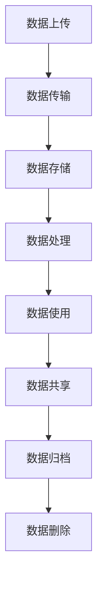
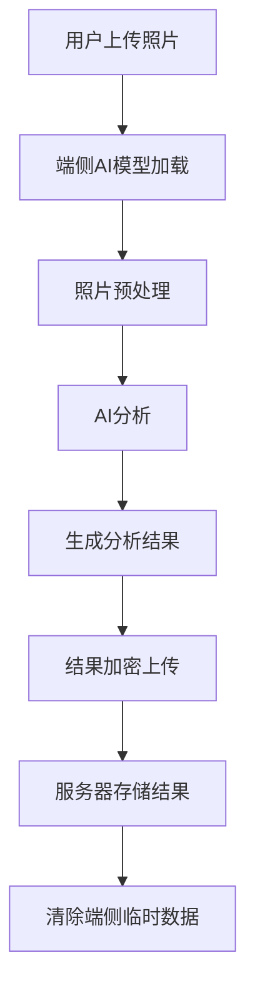
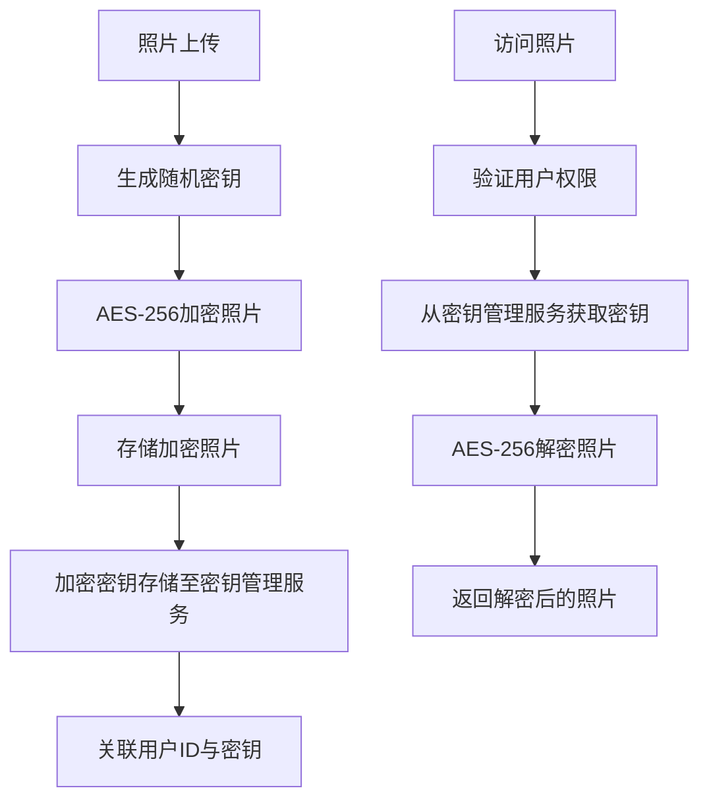
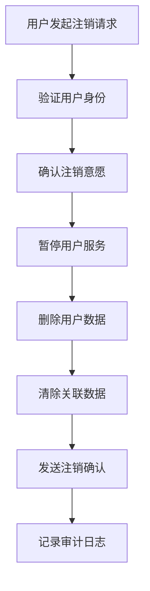
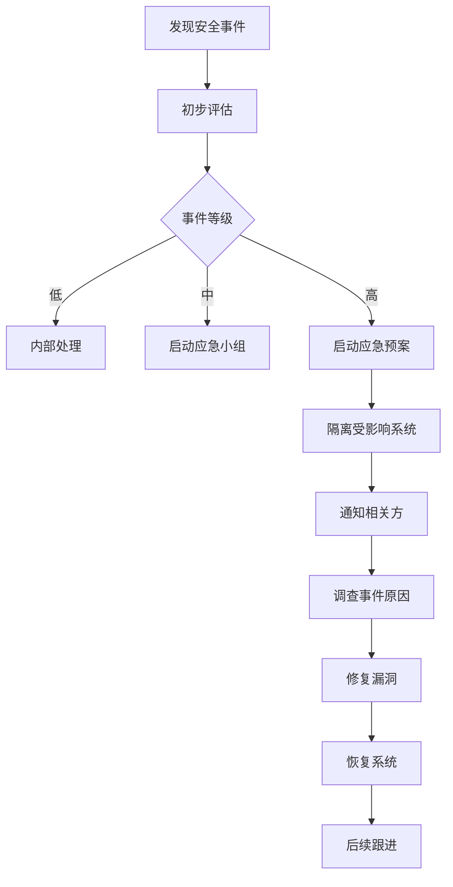

# 数据安全与隐私保护体系

版本：v5.0（去医疗化合规版）  
更新日期：2026年6月17日  
文档类型：安全与隐私

---

## 目录

1. [概述](#1-概述)
2. [数据安全生命周期](#2-数据安全生命周期)
3. [隐私模式选择](#3-隐私模式选择)
4. [端侧AI处理逻辑](#4-端侧AI处理逻辑)
5. [照片加密存储](#5-照片加密存储)
6. [注销数据清除](#6-注销数据清除)
7. [访问控制与权限管理](#7-访问控制与权限管理)
8. [安全审计与监控](#8-安全审计与监控)
9. [应急响应机制](#9-应急响应机制)

---

## 1. 概述

### 1.1 目的
本文档定义了「悦己颜值社」平台的数据安全与隐私保护体系，确保用户数据在全生命周期内得到妥善保护，同时遵守相关法律法规要求。

### 1.2 适用范围
本体系适用于平台所有用户数据的处理，包括但不限于：用户个人信息、面部照片、分析数据、行为数据等。

### 1.3 核心原则

| 原则 | 说明 |
|------|------|
| 隐私保护 | 用户隐私是平台的核心价值 |
| 数据最小化 | 仅收集必要信息，不收集无关数据 |
| 安全加密 | 敏感数据需加密存储和传输 |
| 用户控制 | 用户对自己的数据拥有控制权 |
| 合规透明 | 遵守法规，透明告知用户 |

---

## 2. 数据安全生命周期

### 2.1 生命周期全景图

### 2.2 各阶段安全措施

#### 2.2.1 数据上传

| 措施 | 说明 |
|------|------|
| 文件格式验证 | 只允许JPG/PNG格式，验证文件头 |
| 文件大小限制 | 单文件≤10MB |
| 恶意内容检测 | 使用安全扫描工具检测恶意代码 |
| 用户确认 | 用户确认上传内容为本人照片 |

#### 2.2.2 数据传输

| 措施 | 说明 |
|------|------|
| HTTPS加密 | 所有数据传输使用HTTPS |
| TLS 1.3 | 使用最新TLS协议版本 |
| 证书验证 | 严格验证SSL证书 |
| 数据脱敏 | 传输非必要数据时进行脱敏处理 |

#### 2.2.3 数据存储

| 措施 | 说明 |
|------|------|
| 加密存储 | 敏感数据使用AES-256加密存储 |
| 密钥管理 | 使用密钥管理服务管理加密密钥 |
| 访问控制 | 数据访问需进行权限验证 |
| 定期备份 | 数据定期备份，异地存储 |
| 存储期限 | 根据数据类型设定存储期限 |

#### 2.2.4 数据处理

| 措施 | 说明 |
|------|------|
| 最小权限 | 处理过程仅获取必要权限 |
| 实时处理 | 分析完成后立即清除临时数据 |
| 匿名化处理 | 统计分析使用匿名化数据 |
| 审计日志 | 记录所有数据处理操作 |

#### 2.2.5 数据使用

| 措施 | 说明 |
|------|------|
| 用途限制 | 数据仅用于声明的用途 |
| 用户授权 | 使用数据前需获得用户授权 |
| 个性化推荐 | 基于分析结果提供个性化服务 |
| 拒绝第三方 | 不向第三方出售用户数据 |

#### 2.2.6 数据共享

| 措施 | 说明 |
|------|------|
| 明确授权 | 数据共享需获得用户明确授权 |
| 脱敏处理 | 共享数据需进行脱敏处理 |
| 合作方审核 | 合作方需通过安全审核 |
| 协议约束 | 与合作方签订数据保密协议 |

#### 2.2.7 数据归档

| 措施 | 说明 |
|------|------|
| 归档策略 | 定期归档历史数据 |
| 加密存储 | 归档数据同样加密存储 |
| 检索限制 | 归档数据需特殊权限才能访问 |
| 保留期限 | 根据法规要求设定保留期限 |

#### 2.2.8 数据删除

| 措施 | 说明 |
|------|------|
| 用户请求删除 | 用户可随时请求删除数据 |
| 彻底删除 | 物理删除数据，不留痕迹 |
| 删除确认 | 删除后发送确认通知 |
| 审计记录 | 记录删除操作日志 |

---

## 3. 隐私模式选择

### 3.1 模式定义

| 模式 | 说明 | 适用场景 |
|------|------|---------|
| 严格模式 | 用户照片仅在端侧处理，不上传服务器 | 对隐私要求极高的用户 |
| 标准模式 | 用户照片上传至服务器进行分析 | 希望获得完整分析功能的用户 |

### 3.2 模式对比

| 维度 | 严格模式 | 标准模式 |
|------|---------|---------|
| 照片存储 | 不上传服务器 | 加密存储于服务器 |
| 分析能力 | 端侧AI分析，功能有限 | 完整AI分析能力 |
| 个性化推荐 | 基于端侧数据 | 基于完整数据 |
| 数据安全 | 最高，数据不上传 | 较高，加密存储 |
| 用户体验 | 部分功能受限 | 完整功能体验 |

### 3.3 模式切换

| 操作 | 说明 |
|------|------|
| 首次注册 | 默认选择标准模式 |
| 模式切换 | 用户可随时在设置中切换 |
| 数据迁移 | 切换到严格模式时，服务器数据自动删除 |
| 影响说明 | 切换模式前明确告知用户影响 |

---

## 4. 端侧AI处理逻辑

### 4.1 处理架构

### 4.2 端侧处理步骤

| 步骤 | 说明 | 安全措施 |
|------|------|---------|
| 模型加载 | 从CDN加载AI模型 | 验证模型完整性和签名 |
| 照片预处理 | 调整尺寸、格式转换 | 本地处理，不上传原始照片 |
| AI分析 | 提取面部特征、分析肤质 | 仅保留分析结果，不保留原始数据 |
| 结果加密 | 使用用户公钥加密结果 | 确保传输安全 |
| 数据清除 | 清除端侧临时数据 | 使用安全擦除算法 |

### 4.3 严格模式下的端侧处理

| 步骤 | 说明 |
|------|------|
| 照片不上传 | 用户照片仅在本地处理 |
| 分析结果存储 | 分析结果可选择存储于本地 |
| 离线分析 | 支持离线模式下进行分析 |
| 数据完全可控 | 用户完全控制自己的数据 |

---

## 5. 照片加密存储

### 5.1 加密方案

| 加密层级 | 算法 | 说明 |
|---------|------|------|
| 文件加密 | AES-256-GCM | 照片文件本身加密 |
| 数据库加密 | AES-256-CBC | 数据库字段加密 |
| 传输加密 | TLS 1.3 | HTTPS传输加密 |

### 5.2 加密流程

### 5.3 密钥管理

| 措施 | 说明 |
|------|------|
| 密钥分离 | 加密密钥与数据分离存储 |
| 定期轮换 | 定期轮换加密密钥 |
| 访问控制 | 密钥访问需多级审批 |
| 备份恢复 | 密钥定期备份，支持恢复 |

---

## 6. 注销数据清除

### 6.1 清除流程

### 6.2 清除内容

| 数据类型 | 清除方式 |
|---------|---------|
| 用户基本信息 | 彻底删除 |
| 用户照片 | 彻底删除，包括备份 |
| 分析结果 | 彻底删除 |
| 行为数据 | 彻底删除 |
| 社交关系 | 解除关联，保留匿名数据 |
| 缓存数据 | 清除所有缓存 |

### 6.3 清除验证

| 验证步骤 | 说明 |
|---------|------|
| 删除确认 | 删除完成后发送确认邮件/SMS |
| 残留检查 | 定期检查是否有残留数据 |
| 审计记录 | 记录删除操作日志 |
| 不可恢复 | 确保数据无法恢复 |

---

## 7. 访问控制与权限管理

### 7.1 角色权限

| 角色 | 权限范围 |
|------|---------|
| 普通用户 | 仅访问自己的数据 |
| 管理员 | 访问系统配置，不可访问用户数据 |
| 客服 | 有限访问用户数据，需审批 |
| 审计员 | 仅查看审计日志 |
| 开发人员 | 仅在测试环境访问数据 |

### 7.2 权限控制机制

| 机制 | 说明 |
|------|------|
| RBAC | 基于角色的访问控制 |
| ABAC | 基于属性的访问控制 |
| 最小权限 | 分配最小必要权限 |
| 权限审批 | 敏感权限需审批 |
| 定期审计 | 定期审计权限使用 |

### 7.3 数据访问日志

| 日志内容 | 说明 |
|---------|------|
| 访问时间 | 精确到秒 |
| 访问人员 | 工号和姓名 |
| 访问数据 | 数据类型和ID |
| 访问操作 | 读/写/删除 |
| 访问来源 | IP地址和设备信息 |

---

## 8. 安全审计与监控

### 8.1 审计内容

| 审计项 | 频率 | 说明 |
|--------|------|------|
| 数据访问审计 | 实时 | 监控所有数据访问操作 |
| 权限变更审计 | 实时 | 监控权限变更 |
| 安全事件审计 | 实时 | 监控安全事件 |
| 合规审计 | 每月 | 检查合规情况 |
| 渗透测试 | 每季度 | 进行安全测试 |

### 8.2 监控告警

| 告警类型 | 触发条件 | 响应措施 |
|---------|---------|---------|
| 异常访问 | 非工作时间访问敏感数据 | 实时通知安全团队 |
| 批量下载 | 短时间内下载大量数据 | 立即封禁账号 |
| 数据泄露 | 检测到数据泄露 | 立即启动应急响应 |
| 系统入侵 | 检测到入侵行为 | 立即隔离系统 |

### 8.3 安全指标

| 指标 | 目标值 |
|------|-------|
| 数据泄露事件 | 0次/年 |
| 安全漏洞修复时间 | <24小时 |
| 访问日志留存时间 | 90天 |
| 备份恢复时间 | <4小时 |

---

## 9. 应急响应机制

### 9.1 响应流程

### 9.2 事件分级

| 等级 | 定义 | 响应时间 |
|------|------|---------|
| 低 | 单个用户数据异常 | 24小时内处理 |
| 中 | 多个用户数据异常，无泄露 | 4小时内处理 |
| 高 | 数据泄露、系统入侵 | 立即处理 |

### 9.3 通知机制

| 场景 | 通知对象 | 通知方式 |
|------|---------|---------|
| 数据泄露 | 受影响用户、监管机构 | 邮件、短信 |
| 系统故障 | 所有用户 | 系统公告 |
| 安全漏洞 | 开发团队、安全团队 | 内部通知 |

---

**文档审批：**
- 产品负责人：___________
- 技术负责人：___________
- 安全负责人：___________